**LAPORAN PRAKTIKUM PROJEK UTS**

**WORKSHOP ADMINISTRASI JARINGAN**

**MODUL 1 - DOCKER INSTALASI**

> **Dosen Pengampu :**

Dr Ferry Astika Saputra ST, M.Sc

> {width="3.15625in"
> height="2.643513779527559in"}
>
> **Kelompok 9 :**
>
> **2 D4 Teknik Informatika B**
>
> Putri Maulidya (3124600039)
>
> Muhammad Farid Al-hasan (3124600049)
>
> Nur Legia Erifadina (3124600055)
>
> **PROGRAM STUDI TEKNIK INFORMATIKA**
>
> **DEPARTEMEN TEKNIK INFORMATIKA DAN KOMPUTER**
>
> **POLITEKNIK ELEKTRONIKA NEGERI SURABAYA**
>
> **2026**

**Langkah 0: Persiapan Environment**

Pastikan VM/Host sudah terkoneksi internet untuk dowload image dari
Docker Hub.

\# Cek koneksi internet

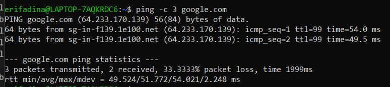{width="5.817708880139983in"
height="1.3189534120734907in"}

\# Update package list

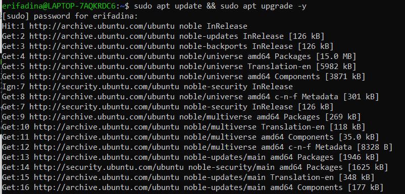{width="5.828125546806649in"
height="2.03125in"}

**Langkah 1: Instalasi Docker Engine di Ubuntu 22.04**

1.1 Hapus versi lama (jika ada)

1.2 Instal dependensi

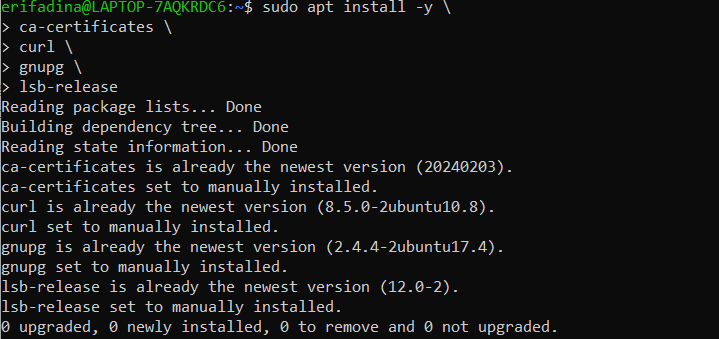{width="5.786458880139983in"
height="2.3958333333333335in"}

1.3 Tambahkan Docker GPG key dan repository

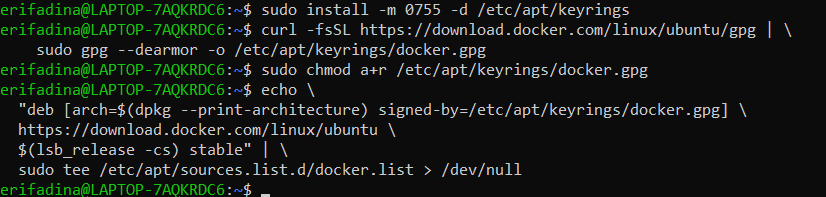{width="5.786458880139983in"
height="1.3879330708661417in"}

1.4 Instal Docker Engine

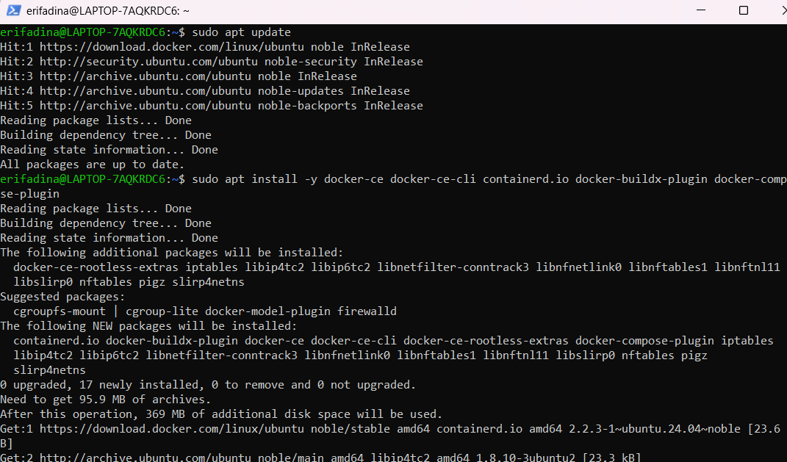{width="6.567708880139983in"
height="3.854040901137358in"}

1.5 Konfigurasi user non-root

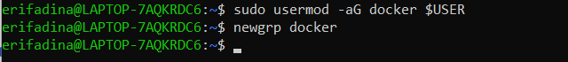{width="5.734375546806649in"
height="0.6041666666666666in"}

1.6 Verifikasi instalasi

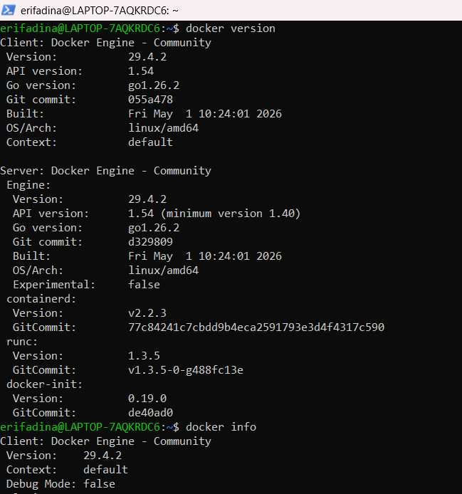{width="4.442708880139983in"
height="4.761467629046369in"}

Expected output docker run hello-word :

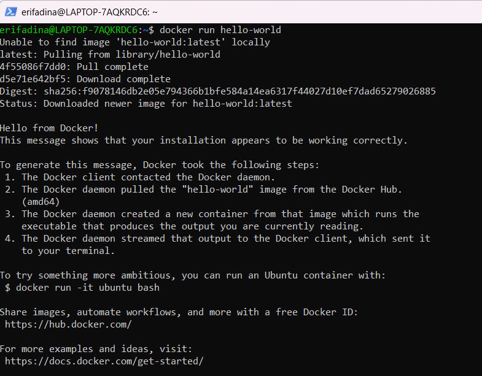{width="5.510416666666667in"
height="3.879815179352581in"}

**Langkah 2: Instalasi Docker Desktop di Windows 10/11**

2.1 Aktifkan WSL2

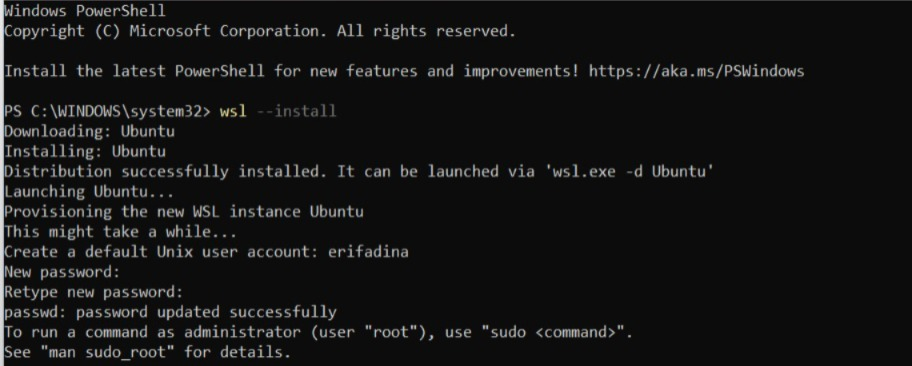{width="5.630208880139983in"
height="2.4583333333333335in"}

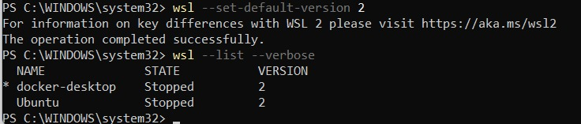{width="5.661458880139983in"
height="1.2083333333333333in"}

2.2 Dowload dan Instal Docker Desktop

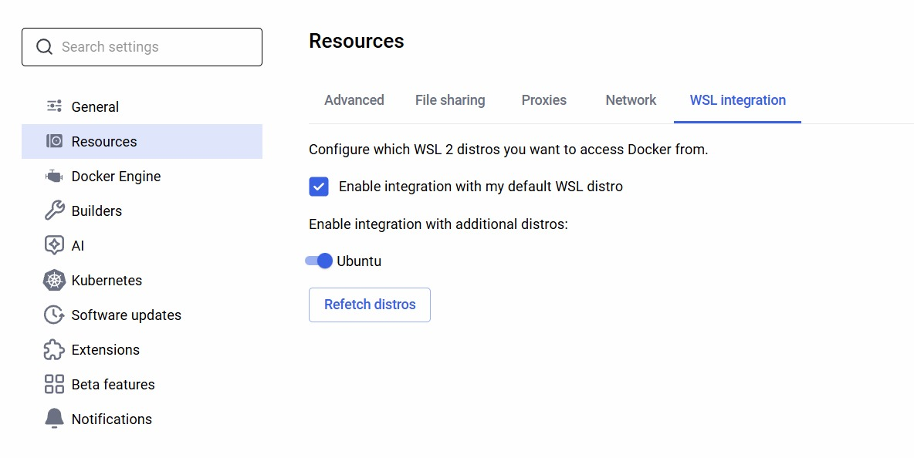{width="4.739583333333333in"
height="2.473429571303587in"}

2.3 Konfigurasi Docker Desktop

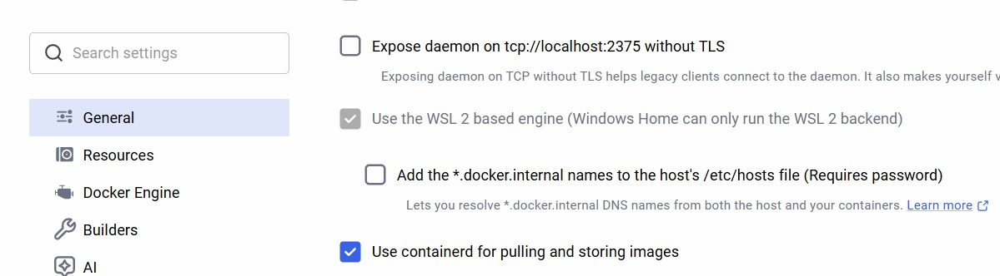{width="4.75in"
height="1.3897025371828522in"}

2.4 Verifikasi dari PoweShell/WSL Terminal

- PowerShell

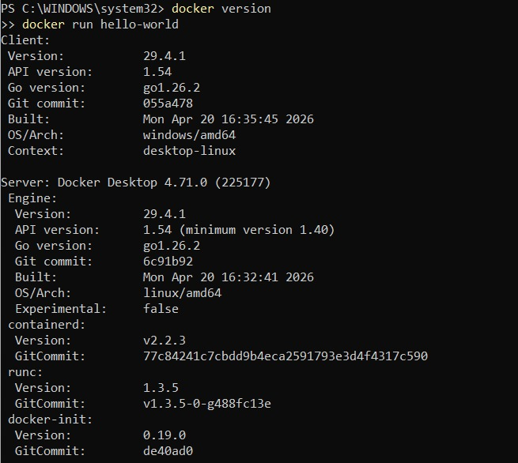{width="4.609375546806649in"
height="3.9791666666666665in"}

- WSL Terminal (Ubuntu)

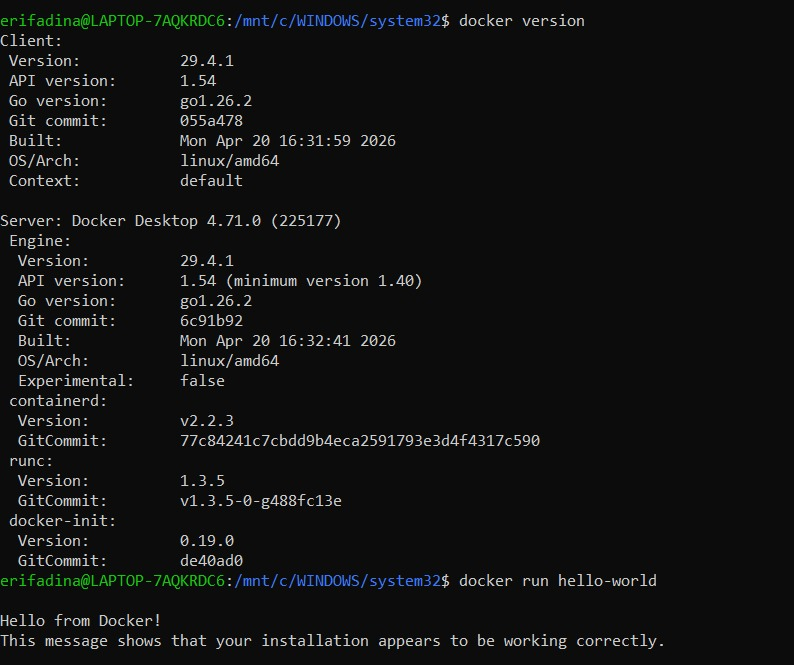{width="4.588542213473316in"
height="4.020833333333333in"}

**Langkah 3: Operasi Dasar Docker Image**

3.1 Pull image dari Docker Hub

\# Pull image nginx versi latest

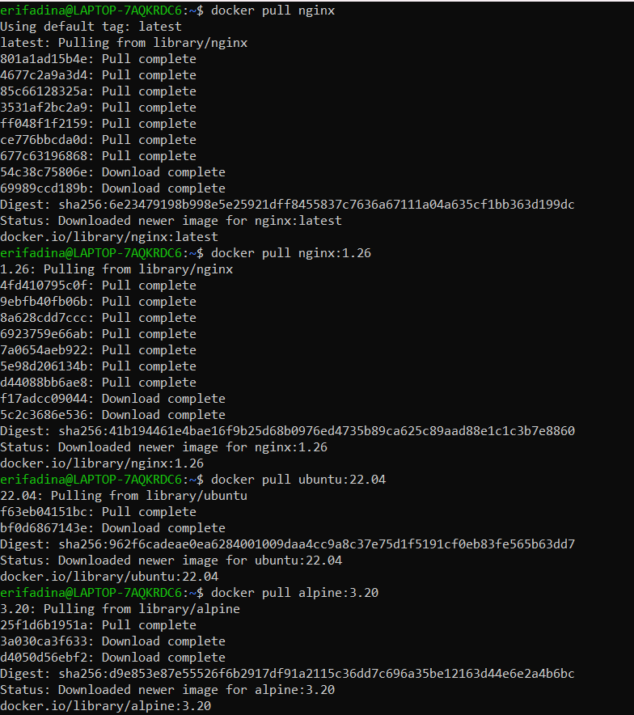{width="4.947916666666667in"
height="1.923251312335958in"}

\# Pull image nginx versi spesifik

{width="4.947916666666667in"
height="1.7879636920384951in"}

\# Pull image Ubuntu 22.04

{width="4.947916666666667in"
height="0.9158464566929134in"}

\# Pull image Alpine (sangat ringan, \~7MB)

{width="4.947916666666667in"
height="1.2635629921259843in"}

3.2 Manajemen image

\# List semua image lokal

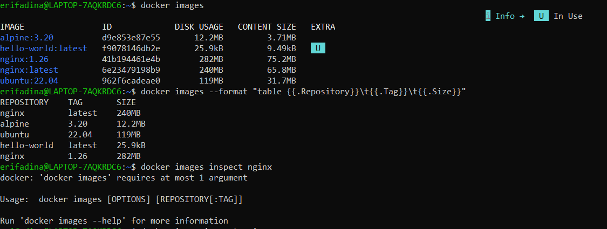{width="5.859375546806649in"
height="1.78125in"}

\# List dengan format custom

{width="5.869792213473316in"
height="0.9166666666666666in"}

\# Inspect detail image

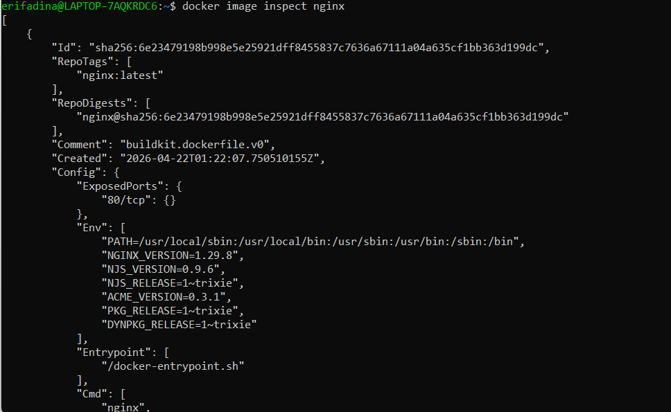{width="5.921875546806649in"
height="3.0104166666666665in"}

\# Hapus image & semua image yang tidak digunakan

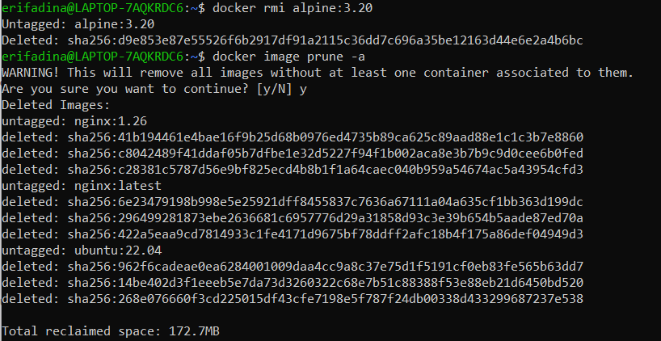{width="5.947916666666667in"
height="2.4294094488188978in"}

**Langkah 4: Menjalankan dan Mengelola Container**

4.1 Menjalankan container dasar

\# Jalankan container nginx (foreground --- tekan Ctrl+C untuk stop)

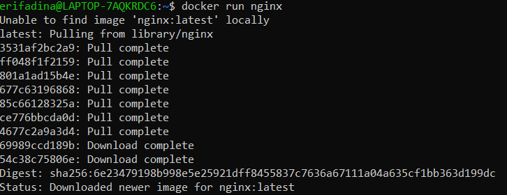{width="5.286458880139983in"
height="1.90625in"}

\# Jalankan nginx di background (detached mode)

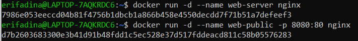{width="5.34375in"
height="0.3075426509186352in"}

\# Jalankan nginx dengan port mapping (host:container)

{width="5.34375in"
height="0.2873326771653543in"}

> [Buka browser ke]{.mark} http://localhost:8080 [:]{.mark}

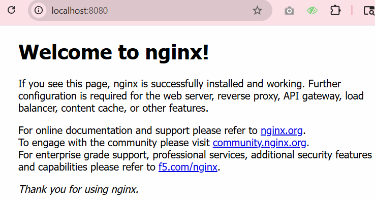{width="5.390625546806649in"
height="2.8125in"}

4.2 Container interaktif

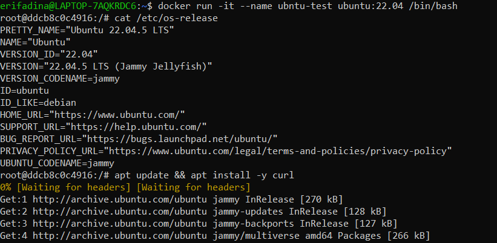{width="5.421875546806649in"
height="2.5625in"}

4.3 Monitoring container

\# List container yang sedang berjalan

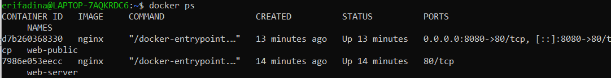{width="5.65625in"
height="0.8826027996500437in"}

\# List SEMUA container (termasuk stopped)

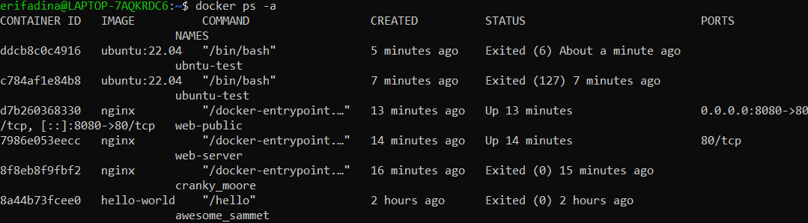{width="5.651042213473316in"
height="1.6979166666666667in"}

\# Lihat log container

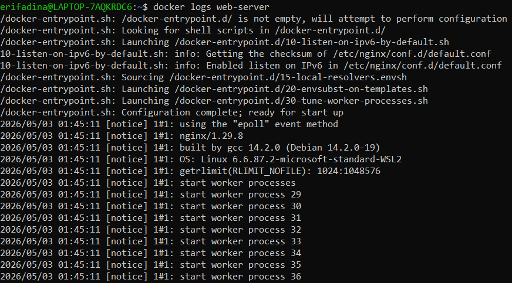{width="5.380208880139983in"
height="2.375in"}

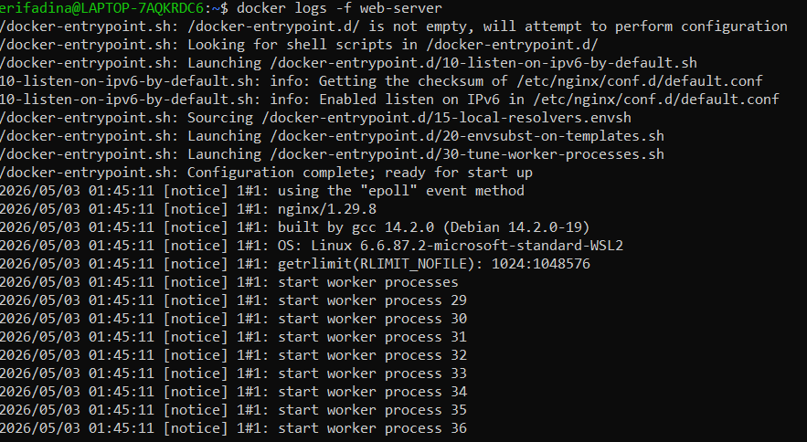{width="5.40625in"
height="2.6302088801399823in"}

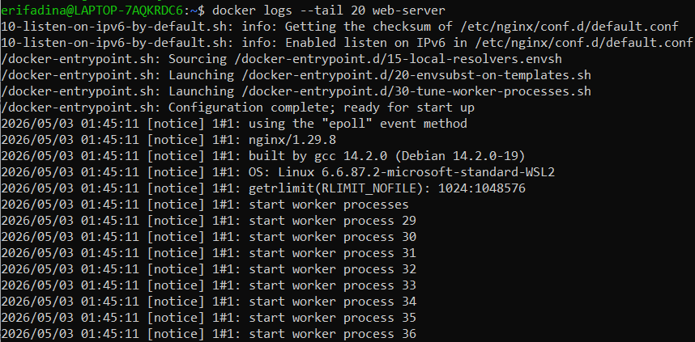{width="5.4375in"
height="2.4843339895013123in"}

\# Lihat resource usage (CPU, Memory, I/O)

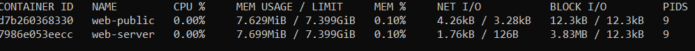{width="5.619792213473316in"
height="0.4583333333333333in"}

\# Lihat detail container

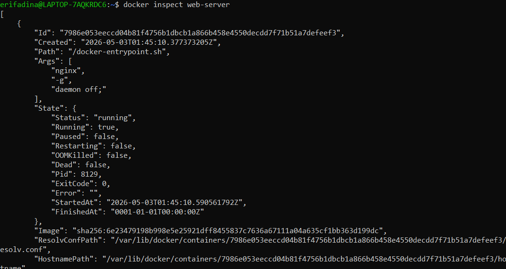{width="5.640625546806649in"
height="2.6354166666666665in"}

4.4 Interaksi dengan container berjalan

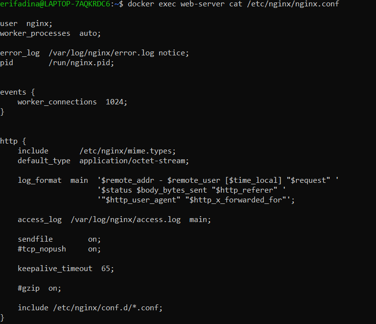{width="5.453125546806649in"
height="3.6041666666666665in"}

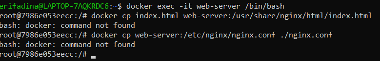{width="5.442708880139983in"
height="0.8950634295713036in"}

4.5 Lifecycle management

\# Stop container

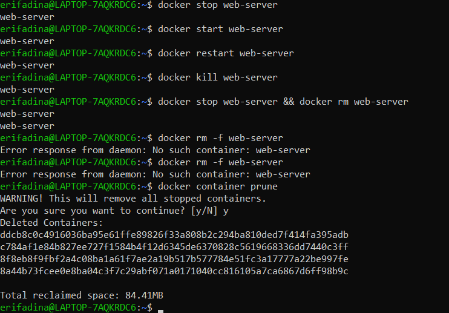{width="5.432292213473316in"
height="0.3333333333333333in"}

\# Start container yang sudah di-stop

{width="5.4375in"
height="0.367580927384077in"}

\# Restart container

{width="5.4375in"
height="0.3270395888013998in"}

\# Kill container (force stop --- SIGKILL)

{width="5.4375in" height="0.34375in"}

\# Hapus container (harus dalam keadaan stopped)

{width="5.4375in"
height="0.5104166666666666in"}

\# Hapus container secara paksa (meskipun masih running)

{width="5.4375in"
height="0.7488746719160105in"}

\# Hapus SEMUA stopped container

{width="5.4375in"
height="1.6279571303587053in"}

**Langkah 5: Membuat Custom Image dengan Dockerfile**

5.1 Buat Project Directory

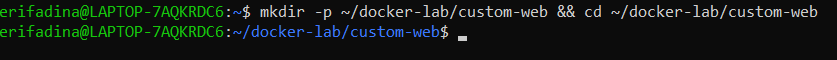{width="5.432292213473316in"
height="0.4479166666666667in"}

5.2 Buat Halaman Web

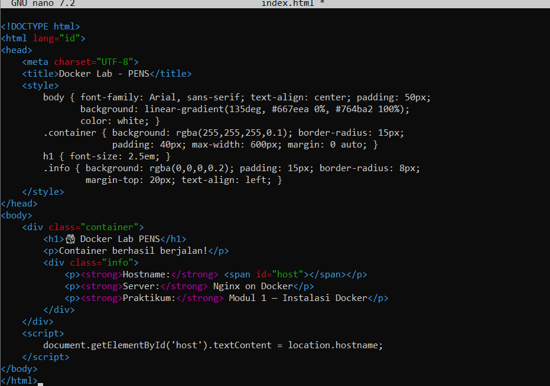{width="5.395833333333333in"
height="3.5783486439195102in"}

5.3 Buat Dockerfile

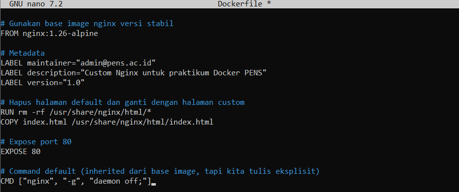{width="5.567708880139983in"
height="2.3306681977252843in"}

5.4 Build dan Jalankan

\# Build image (titik di akhir = build context = direktori saat ini)

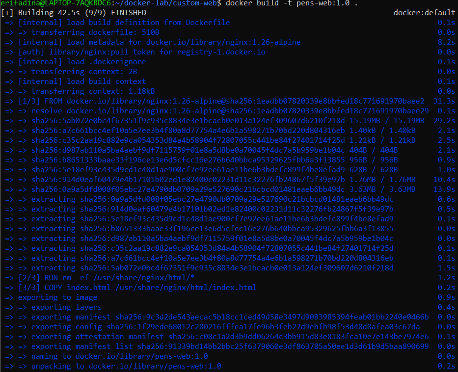{width="5.674459755030621in"
height="4.15096675415573in"}

\# Verifikasi image berhasil dibuat

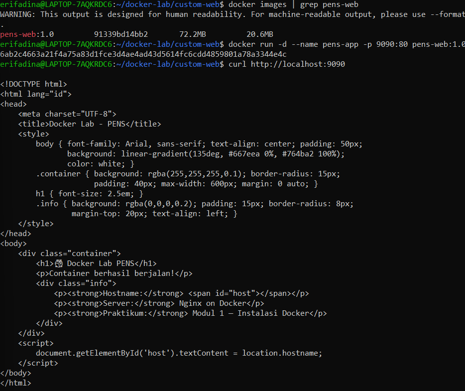{width="5.749865485564304in"
height="0.5543350831146107in"}

\# Jalankan container dari image custom

{width="5.510416666666667in"
height="0.38654199475065615in"}

\# Test

{width="5.557292213473316in"
height="4.040681321084865in"}

> [Buka browser ke]{.mark} http://localhost:9090 [:]{.mark}

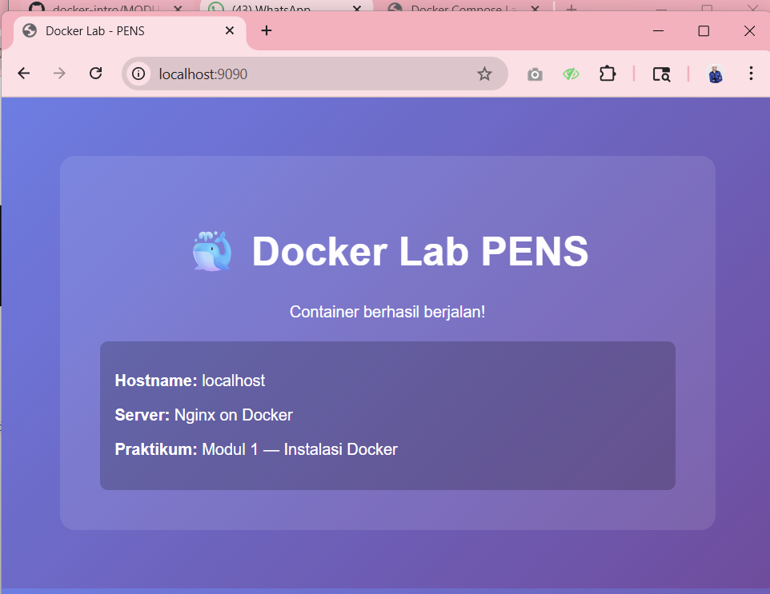{width="4.911458880139983in"
height="3.582600612423447in"}

5.5 Lihat layer Image

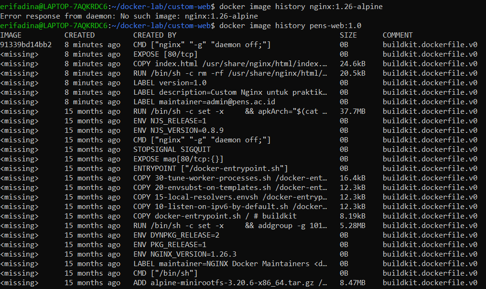{width="5.484375546806649in"
height="3.2640212160979876in"}

### **Langkah 6: Docker System Cleanup**

\# Lihat disk usage Docker

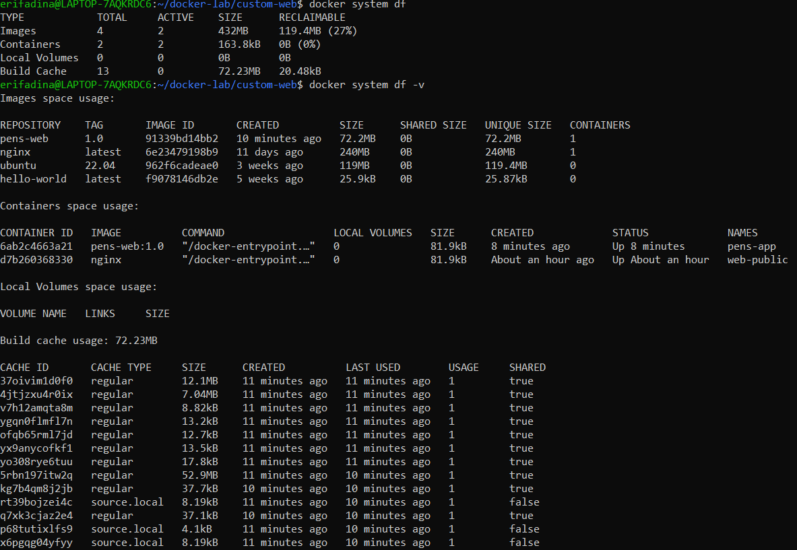{width="5.661458880139983in"
height="0.8125in"}

\# Lihat detail disk usage

{width="5.635416666666667in"
height="3.5338746719160103in"}

\# Hapus semua resource yang tidak digunakan (container, image, network,
cache)

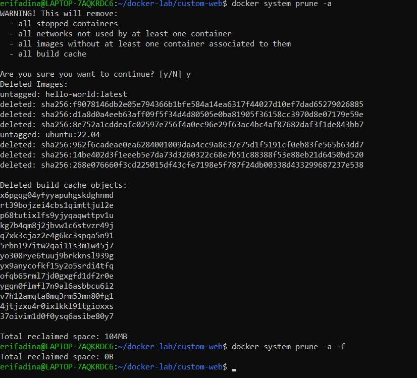{width="5.619792213473316in"
height="3.875in"}

\# Konfirmasi dengan -f (force, tanpa prompt)

{width="5.598958880139983in"
height="0.6562882764654419in"}

## **[PERTANYAAN]{.underline}**

### Pre-Lab (jawab sebelum praktikum)

1.  Sebutkan minimal 3 perbedaan antara Virtual Machine dan Container.

> Jawab :

- VM cocok untuk menjalankan OS berbeda.

- Container coock untuk deployment aplikasi modern dan microservices

Berikut detail perbedaannya :

  ------------------------------- -------------------------------
     **Virtual Machine (VM)**              **Container**
     Memiliki Guest OS sendiri        Berbagi kernel host OS
        Ukuran lebih besar                 Lebih ringan
        Booting lebih lama             Startup sangat cepat
      Menggunakan hypervisor       Menggunakan container runtime
        Isolasi lebih penuh            Isolasi level proses
   Resource CPU/RAM lebih banyak       Resource lebih hemat
  ------------------------------- -------------------------------

2.  Apa fungsi dari containerd dan runc dalam arsitektur Docker?

> Jawab :

- containerd

  - Bertugas mengelola lifecycle container.

  - Mengatur image, storage, networking, dan container execution.

  - Menjadi perantara antara Docker Engine dan low-level runtime.

- runc

  - Low-level runtime untuk menjalankan container sesuai standar OCI
    (Open Container Initiative).

  - Bertugas membuat dan menjalankan proses container menggunakan Linux
    namespaces dan cgroups.

Alur sederhananya:\
Docker CLI → Docker Engine → containerd → runc → Container berjalan.

3.  Mengapa Docker membutuhkan kernel Linux? Bagaimana Docker Desktop di
    Windows mengatasi hal ini?

> Jawab :
>
> Docker menggunakan fitur kernel Linux seperti:

- namespaces

- cgroups

- union filesystem

> Karena fitur tersebut berasal dari kernel Linux, Docker secara native
> berjalan di Linux. Di Windows, Docker Desktop mengatasinya dengan:

- menjalankan Linux kernel ringan menggunakan:

  - WSL2 (Windows Subsystem for Linux 2), atau

  - VM kecil berbasis Hyper-V.

> Jadi sebenarnya container Linux tetap berjalan di lingkungan Linux
> virtual.

4.  Apa keuntungan layered filesystem pada Docker Image?

> Jawab :
>
> Keuntungan layered filesystem:

1.  Hemat storage

- Layer yang sama dapat dipakai bersama banyak image.

2.  Build lebih cepat

- Docker menggunakan cache layer.

3.  Transfer lebih efisien

- Saat pull image, hanya layer yang belum ada yang di-download.

4.  Mudah versioning

- Perubahan hanya menambah layer baru.

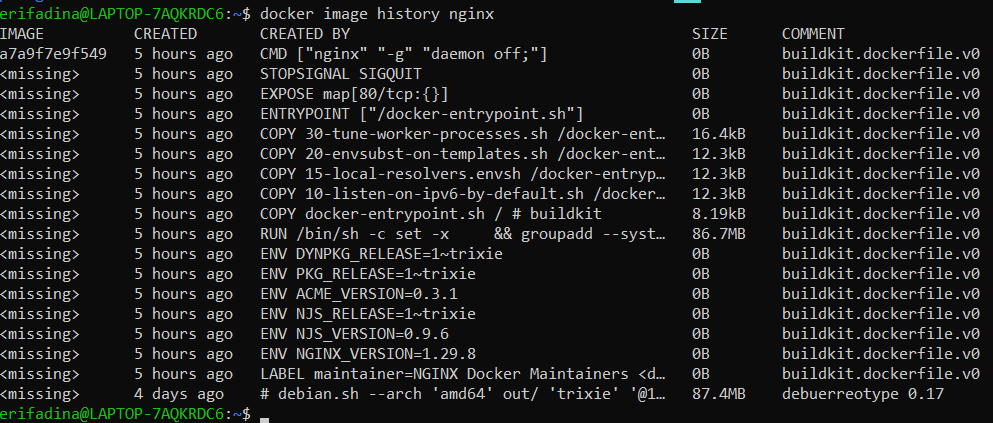{width="6.107400481189852in"
height="2.7440594925634296in"}

> Berdasarkan hasil docker image history nginx, terlihat bahwa image
> Docker terdiri dari beberapa layer seperti RUN, COPY, ENV, EXPOSE, dan
> CMD. Hal ini membuktikan bahwa Docker menggunakan layered filesystem,
> di mana setiap instruksi membentuk layer tersendiri.

5.  Jelaskan perbedaan antara docker run dan docker exec.

> Jawab :
>
> Perbedaan antara docker run dan docker exec :

- docker run digunakan untuk membuat sekaligus menjalankan container
  baru dari sebuah image Docker. Saat perintah ini dijalankan, Docker
  akan membuat container baru jika container tersebut belum ada,
  kemudian menjalankan proses di dalamnya. Perintah ini biasanya
  digunakan saat pertama kali menjalankan aplikasi atau service di dalam
  container.

- Sedangkan docker exec digunakan untuk menjalankan command tambahan
  pada container yang sudah berjalan tanpa membuat container baru.
  Perintah ini biasanya digunakan untuk masuk ke terminal container,
  melakukan pengecekan, debugging, atau menjalankan command tertentu
  pada container yang aktif.

> Jadi, perbedaan utamanya adalah docker run membuat container baru,
> sedangkan docker exec hanya menjalankan command pada container yang
> sudah ada dan sedang berjalan.
>
> 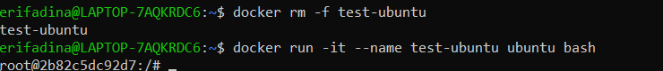{width="6.267716535433071in"
> height="0.6805555555555556in"}
>
> 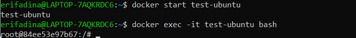{width="6.267716535433071in"
> height="0.6805555555555556in"}

### Post-Lab (jawab setelah praktikum)

1.  Bandingkan output docker image history nginx dengan docker image
    history pens-web:1.0. Layer mana saja yang di-share?

> Jawab :
>
> 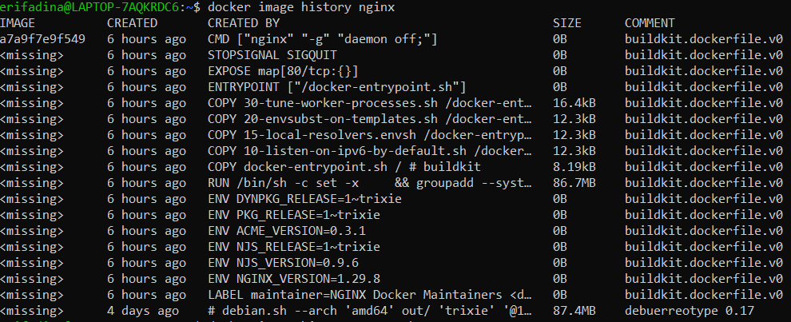{width="5.411458880139983in"
> height="2.0104166666666665in"}
>
> Berdasarkan hasil docker image history, terlihat bahwa image
> pens-web:1.0 menggunakan beberapa layer yang sama dengan image nginx,
> seperti layer CMD, EXPOSE, ENTRYPOINT, COPY, dan ENV. Hal ini
> menunjukkan bahwa Docker menggunakan layered filesystem sehingga layer
> yang sama dapat digunakan kembali untuk menghemat storage dan
> mempercepat proses build image.

2.  Apa yang terjadi pada data di dalam container setelah container
    dihapus dengan docker rm? Bagaimana solusinya?

> Jawab :
>
> 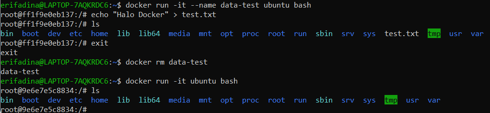{width="5.770833333333333in"
> height="1.4389577865266843in"}
>
> Berdasarkan percobaan, data di dalam container akan hilang setelah
> container dihapus menggunakan docker rm karena filesystem container
> bersifat sementara (ephemeral). Namun setelah menggunakan Docker
> Volume, file test.txt tetap ada meskipun container dihapus dan dibuat
> ulang. Hal ini menunjukkan bahwa Docker Volume dapat digunakan untuk
> menyimpan data secara permanen di luar container.
>
> 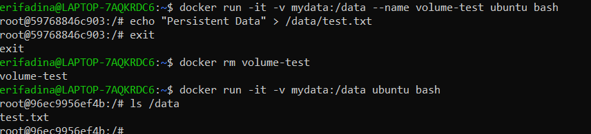{width="5.833333333333333in"
> height="1.2425065616797901in"}

3.  Jelaskan perbedaan antara EXPOSE di Dockerfile dan flag -p pada
    docker run. Apakah EXPOSE cukup untuk membuat port dapat diakses
    dari host?

> Jawab :
>
> EXPOSE pada Dockerfile digunakan untuk memberikan informasi bahwa
> container menggunakan port tertentu. Namun EXPOSE tidak otomatis
> membuat port tersebut dapat diakses dari host. Agar port container
> bisa diakses dari host atau browser, diperlukan flag -p pada saat
> menjalankan container untuk melakukan port mapping antara host dan
> container.
>
> 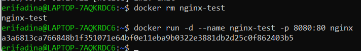{width="5.630208880139983in"
> height="0.7708333333333334in"}

{width="5.317708880139983in"
height="2.4375in"}

> Berdasarkan percobaan, container nginx yang dijalankan tanpa flag -p
> tidak dapat diakses dari host. Setelah menggunakan -p 8080:80, website
> nginx berhasil diakses melalui browser. Hal ini menunjukkan bahwa
> EXPOSE hanya sebagai informasi port pada container, sedangkan -p
> digunakan untuk membuka akses port ke host.

4.  Mengapa menggunakan tag spesifik (misal nginx:1.26) lebih baik
    daripada nginx:latest untuk production?

> Jawab :

- Menggunakan tag spesifik seperti nginx:1.26 lebih baik dibandingkan
  nginx:latest untuk production karena versi image yang digunakan
  menjadi lebih jelas, konsisten, dan stabil. Tag latest dapat berubah
  sewaktu-waktu ketika image diperbarui sehingga berisiko menyebabkan
  perubahan sistem atau bug yang tidak terduga pada aplikasi production.

- Dengan menggunakan tag spesifik, developer dapat memastikan bahwa
  environment development, testing, dan production menggunakan versi
  image yang sama. Selain itu, proses debugging dan maintenance menjadi
  lebih mudah karena versi image yang digunakan sudah diketahui secara
  pasti.

5.  Berapa ukuran image alpine:3.20 dibanding ubuntu:22.04? Apa
    trade-off menggunakan Alpine?

> Jawab :
>
> 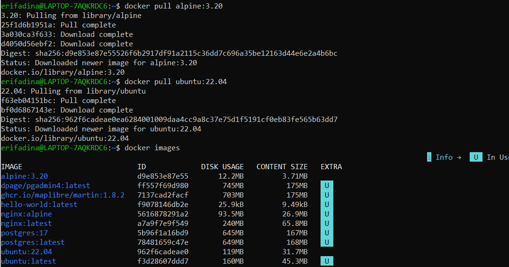{width="6.155795056867891in"
> height="3.2219236657917762in"}
>
> Ukuran image alpine:3.20 jauh lebih kecil dibandingkan ubuntu:22.04.
> Berdasarkan hasil percobaan menggunakan docker images, ukuran
> alpine:3.20 sekitar 12.2 MB, sedangkan ubuntu:22.04 sekitar 119 MB.
>
> Keuntungan menggunakan Alpine adalah image lebih ringan, lebih cepat
> di-download, dan lebih hemat storage. Namun trade-off menggunakan
> Alpine yaitu tools bawaan lebih sedikit, proses debugging lebih sulit,
> serta beberapa aplikasi atau library mungkin tidak kompatibel karena
> Alpine menggunakan musl libc sedangkan Ubuntu menggunakan glibc.

**LAPORAN PRAKTIKUM PROJEK UTS**

**WORKSHOP ADMINISTRASI JARINGAN**

**MODUL 2 - DOCKER SERVICE MOUNT**

> **Dosen Pengampu :**

Dr Ferry Astika Saputra ST, M.Sc

> {width="3.15625in"
> height="2.643513779527559in"}
>
> **Kelompok 9 :**
>
> **2 D4 Teknik Informatika B**
>
> Putri Maulidya (3124600039)
>
> Muhammad Farid Al-hasan (3124600049)
>
> Nur Legia Erifadina (3124600055)
>
> **PROGRAM STUDI TEKNIK INFORMATIKA**
>
> **DEPARTEMEN TEKNIK INFORMATIKA DAN KOMPUTER**
>
> **POLITEKNIK ELEKTRONIKA NEGERI SURABAYA**
>
> **2026**

### **Langkah 1: Docker Network**

#### 1.1 Eksplorasi network default

> \# List semua network Docker
>
> 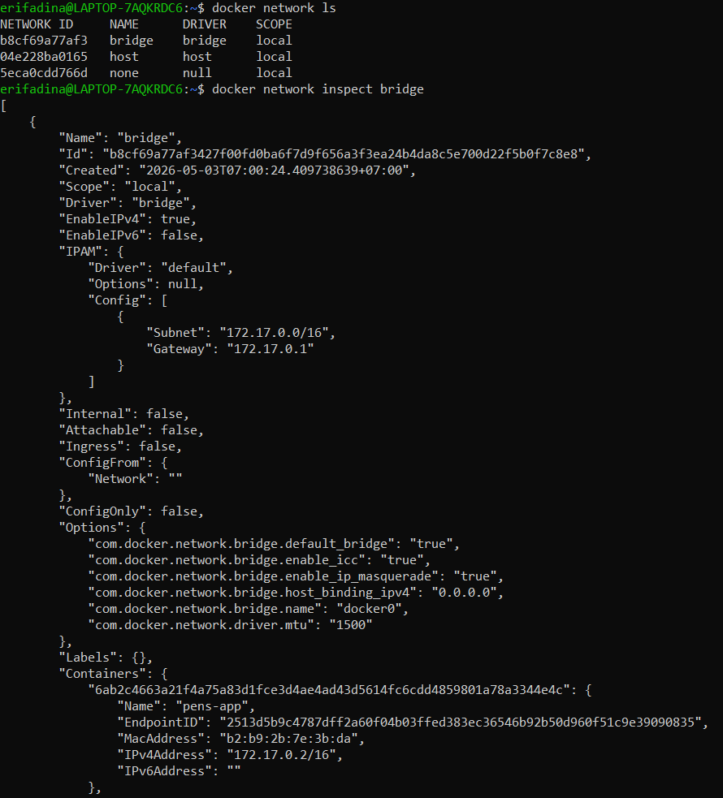{width="5.432292213473316in"
> height="0.7916666666666666in"}
>
> \# Inspect network bridge default
>
> {width="5.328125546806649in"
> height="5.28125in"}

#### 1.2 Buat user-defined bridge network

> docker network create \--driver bridge \--subnet 172.20.0.0/16 lab-net
>
> {width="5.973958880139983in"
> height="0.3229166666666667in"}
>
> \# Verifikasi
>
> {width="5.739583333333333in"
> height="4.963542213473316in"}

#### 1.3 Test DNS resolution antar container

> \# Jalankan 2 container di network yang sama
>
> {width="5.697916666666667in"
> height="1.5761493875765529in"}
>
> \# Test DNS --- container bisa saling resolve by nama
>
> {width="5.994792213473316in"
> height="1.8958333333333333in"}
>
> \# Bandingkan: default bridge TIDAK bisa resolve nama
>
> {width="6.0016480752405945in"
> height="2.222832458442695in"}
>
> \# Cleanup
>
> {width="5.984375546806649in"
> height="0.9895833333333334in"}

### **Langkah 2: Docker Volume**

#### 2.1 Buat dan kelola volume

{width="5.751405293088364in"
height="3.09375in"}

#### 2.2 Gunakan volume di container

> \# Container penulis --- tulis timestamp ke volume setiap 5 detik
>
> {width="5.942708880139983in"
> height="1.293231627296588in"}
>
> \# Tunggu 15 detik, lalu baca dari container BERBEDA
>
> docker run \--rm -v data-vol:/data alpine:3.20 cat /data/log.txt
>
> {width="6.036458880139983in"
> height="4.104166666666667in"}

#### 2.3 Volume persist setelah container dihapus

docker rm -f writer

\# Data masih ada!

docker run \--rm -v data-vol:/data alpine:3.20 cat /data/log.txt

{width="5.588542213473316in"
height="2.7916666666666665in"}

#### 2.4 Backup dan restore volume

{width="5.604166666666667in"
height="3.9872976815398076in"}

### **Langkah 3: Bind Mount**

#### 3.1 Buat project

> mkdir -p \~/docker-lab/web-dev/html && cd \~/docker-lab/web-dev
>
> {width="5.796875546806649in"
> height="1.46875in"}

#### 3.2 Jalankan container dengan bind mount

{width="5.723958880139983in"
height="1.3229166666666667in"}

#### 3.3 Test live-reload

> \# curl [[http://localhost:8080]{.underline}](http://localhost:8080)
>
> {width="5.854166666666667in"
> height="3.653729221347332in"}
>
> \# Edit file di HOST → langsung terlihat di container tanpa restart!
>
> {width="5.807292213473316in"
> height="3.8125in"}

### **Langkah 4: tmpfs Mount**

{width="5.734375546806649in"
height="0.625in"}

> \# Baca data

{width="5.739583333333333in"
height="0.34706911636045495in"}

> \# Stop & start → data HILANG

{width="5.739583333333333in"
height="1.0839643482064742in"}

### **Langkah 5: Aplikasi Multi-Container dengan Docker Compose**

#### 5.1 Buat project structure

{width="5.630208880139983in"
height="0.40625in"}

#### 5.2 Buat halaman Nginx

{width="5.630208880139983in"
height="3.375in"}

#### 5.3 Buat Flask app + Dockerfile

{width="5.640625546806649in"
height="4.770833333333333in"}

#### 5.4 Buat Nginx config

{width="5.625in"
height="2.0468952318460194in"}

#### 5.5 Buat docker-compose.yml

{width="5.645833333333333in"
height="5.126025809273841in"}

#### 5.6 Jalankan dan verifikasi

> \# Build dan start
>
> {width="5.994792213473316in"
> height="5.239583333333333in"}
>
> \# Cek status
>
> {width="6.015625546806649in"
> height="1.28125in"}
>
> \# Test
>
> {width="6.267716535433071in"
> height="5.666666666666667in"}
>
> [Buka browser ke]{.mark} http://localhost:8080 [:]{.mark}
>
> {width="5.9624311023622045in"
> height="3.1196292650918633in"}
>
> \# Cek network dan volume
>
> {width="6.286458880139983in"
> height="1.9166666666666667in"}
>
> \# Lifecycle
>
> {width="6.265625546806649in"
> height="0.8541666666666666in"}

## **[PERTANYAAN]{.underline}**

### Pre-Lab (jawab sebelum praktikum)

1.  Apa perbedaan default bridge dan user-defined bridge network?

> Jawab :

- Default bridge network adalah network bawaan Docker yang otomatis
  dibuat ketika Docker diinstal. Container yang berada pada default
  bridge tidak memiliki DNS otomatis sehingga komunikasi antar container
  biasanya menggunakan IP address secara manual.

- Sedangkan user-defined bridge network adalah network yang dibuat
  sendiri oleh user menggunakan docker network create. Network ini
  memiliki fitur DNS internal sehingga container dapat saling
  berkomunikasi menggunakan nama container. Selain itu, user-defined
  bridge lebih fleksibel untuk konfigurasi isolasi, keamanan, dan
  komunikasi antar service.

2.  Kapan menggunakan Volume vs Bind Mount vs tmpfs?

> Jawab :

- Docker Volume digunakan untuk menyimpan data secara permanen dan
  dikelola langsung oleh Docker. Volume cocok digunakan untuk database
  atau data penting karena lebih aman dan mudah dipindahkan antar
  container.

- Bind Mount digunakan untuk menghubungkan folder dari host ke container
  secara langsung. Bind mount cocok digunakan saat development karena
  perubahan file di host langsung terlihat di container.

- Sedangkan tmpfs digunakan untuk menyimpan data sementara di memory
  (RAM) tanpa ditulis ke disk. tmpfs cocok digunakan untuk data
  sementara atau sensitif karena performanya lebih cepat dan data akan
  hilang ketika container berhenti.

3.  Apa yang terjadi pada named volume saat docker compose down?
    Bagaimana jika pakai flag -v?

> Jawab :
>
> Named volume tidak akan terhapus saat menjalankan docker compose down
> biasa. Docker hanya menghentikan dan menghapus container serta
> network, sedangkan volume tetap disimpan sehingga data masih dapat
> digunakan kembali.
>
> Namun jika menggunakan: docker compose down -v , maka named volume
> juga akan ikut dihapus. Berdasarkan percobaan, volume
> compose-app_pg-data masih ada setelah menjalankan docker compose down,
> tetapi hilang setelah menggunakan docker compose down -v.
>
> {width="5.609375546806649in"
> height="3.3541666666666665in"}
>
> Berdasarkan percobaan, volume compose-app_pg-data masih ada setelah
> menjalankan docker compose down, tetapi terhapus setelah menggunakan
> docker compose down -v. Hal ini menunjukkan bahwa flag -v digunakan
> untuk menghapus named volume beserta data di dalamnya.

4.  Apa fungsi depends_on dan healthcheck di docker-compose.yml?

> Jawab :
>
> depends_on digunakan untuk mengatur urutan startup antar service pada
> docker-compose.yml. Dengan depends_on, Docker Compose dapat
> menjalankan service tertentu terlebih dahulu sebelum service lain
> dijalankan. Sedangkan healthcheck digunakan untuk mengecek apakah
> container berjalan dengan normal dan siap digunakan. Healthcheck
> memastikan service benar-benar siap menerima request, bukan hanya
> sekadar status container running.

5.  Mengapa user-defined bridge bisa DNS resolve nama container,
    sedangkan default bridge tidak?

> Jawab :

- User-defined bridge network memiliki DNS internal bawaan Docker
  sehingga container dapat saling berkomunikasi menggunakan nama
  container sebagai hostname. Hal ini memudahkan komunikasi antar
  service tanpa perlu mengetahui IP address container.

- Sedangkan default bridge network tidak memiliki fitur DNS otomatis
  antar container sehingga komunikasi biasanya harus menggunakan IP
  address secara manual atau menggunakan fitur legacy seperti \--link.

> {width="5.135416666666667in"
> height="2.5366207349081367in"}
>
> Berdasarkan percobaan, container c1 berhasil melakukan ping c2
> menggunakan nama container tanpa menggunakan IP address secara manual.
> Hal ini menunjukkan bahwa user-defined bridge network memiliki DNS
> internal bawaan Docker untuk melakukan name resolution antar
> container.

### Post-Lab (jawab setelah praktikum)

1.  Jalankan docker network inspect lab-frontend. Sebutkan container dan
    IP masing-masing.

> Jawab :
>
> {width="5.484375546806649in"
> height="2.0in"}
>
> Berdasarkan hasil docker network inspect compose-app_frontend,
> container yang terhubung ke network tersebut adalah lab-app dengan IP
> address 172.21.0.2/16. Docker secara otomatis memberikan IP address
> pada setiap container dalam network sehingga container dapat saling
> berkomunikasi secara internal.

2.  Hapus container lab-db lalu docker compose up -d lagi. Apakah data
    PostgreSQL masih ada? Mengapa?

> Jawab :
>
> Data PostgreSQL tetap ada setelah container lab-db dihapus lalu
> dijalankan kembali menggunakan docker compose up -d. Hal ini terjadi
> karena PostgreSQL menggunakan Docker Volume untuk menyimpan data
> secara permanen di luar filesystem container.
>
> {width="6.109375546806649in"
> height="1.2395833333333333in"}
>
> {width="6.130208880139983in"
> height="2.2402755905511813in"}
>
> Berdasarkan percobaan, database labdb masih muncul setelah container
> lab-db dihapus dan dijalankan kembali. Hal ini membuktikan bahwa
> Docker Volume dapat menyimpan data PostgreSQL secara persistent
> meskipun container dihapus.

3.  Tunjukkan perbedaan output docker inspect untuk mount type volume vs
    bind.

> Jawab :
>
> Mount type volume dikelola langsung oleh Docker dan digunakan untuk
> penyimpanan data permanen. Sedangkan mount type bind langsung
> menghubungkan folder dari host ke container sehingga perubahan file
> pada host langsung terlihat di container.
>
> {width="5.453125546806649in"
> height="1.7708333333333333in"}
>
> {width="5.494792213473316in"
> height="2.8229166666666665in"}
>
> Berdasarkan hasil docker inspect, container lab-db menggunakan mount
> type volume untuk menyimpan data PostgreSQL secara persistent.
> Sedangkan container lab-web menggunakan bind mount untuk menghubungkan
> folder HTML dan file konfigurasi dari host ke container.

4.  Jelaskan alur request dari browser → Nginx → Flask → PostgreSQL.

> Jawab :

- Saat user mengakses aplikasi melalui browser, request pertama kali
  diterima oleh Nginx sebagai web server dan reverse proxy. Nginx
  kemudian meneruskan request tersebut ke aplikasi Flask untuk diproses.
  Jika aplikasi Flask membutuhkan data, Flask akan mengirim query ke
  PostgreSQL untuk mengambil atau menyimpan data database. Setelah data
  diproses, hasil dikirim kembali dari PostgreSQL ke Flask, lalu
  diteruskan ke Nginx dan akhirnya dikirim ke browser user.

- Nginx berfungsi sebagai frontend dan reverse proxy, Flask menangani
  logic aplikasi, sedangkan PostgreSQL digunakan sebagai backend
  database untuk menyimpan data aplikasi.

5.  Bandingkan ukuran image yang digunakan stack ini. Mana terbesar dan
    mengapa?

> Jawab :
>
> Berdasarkan hasil docker images, ukuran image pada stack berbeda-beda.
> Image postgres:latest merupakan image terbesar dengan ukuran sekitar
> 649 MB, sedangkan image seperti nginx:alpine dan alpine:3.20 memiliki
> ukuran jauh lebih kecil.
>
> Image PostgreSQL menjadi yang terbesar karena mengandung database
> engine, library, dan dependency tambahan yang dibutuhkan untuk
> menjalankan layanan database. Sedangkan image berbasis Alpine lebih
> ringan karena menggunakan base image minimalis dan hanya memuat
> package penting saja.
>
> {width="6.267716535433071in"
> height="2.6527777777777777in"}
>
> Berdasarkan hasil percobaan menggunakan docker images, image
> PostgreSQL membutuhkan storage lebih besar dibanding image lain karena
> memiliki lebih banyak dependency dan package untuk layanan database.
> Sedangkan image berbasis Alpine lebih ringan dan hemat storage.

**LAPORAN PRAKTIKUM PROJEK UTS**

**WORKSHOP ADMINISTRASI JARINGAN**

**MODUL 3 - WEB SERVICE DOCKER**

> **Dosen Pengampu :**

Dr Ferry Astika Saputra ST, M.Sc

> {width="3.15625in"
> height="2.643513779527559in"}
>
> **Kelompok 9 :**
>
> **2 D4 Teknik Informatika B**
>
> Putri Maulidya (3124600039)
>
> Muhammad Farid Al-hasan (3124600049)
>
> Nur Legia Erifadina (3124600055)
>
> **PROGRAM STUDI TEKNIK INFORMATIKA**
>
> **DEPARTEMEN TEKNIK INFORMATIKA DAN KOMPUTER**
>
> **POLITEKNIK ELEKTRONIKA NEGERI SURABAYA**
>
> **2026**

**Langkah 0: Persiapan Project**

mkdir -p
\~/docker-lab/web-service/{apache/{sites,html-site1,html-site2},nginx,flask,certs,logs}

cd \~/docker-lab/web-service

{width="5.901093613298338in"
height="0.7395833333333334in"}

**Langkah 1: Konfigurasi Apache2 dengan Virtual Host**

1.1 Buat halaman web untuk dua virtual host

{width="5.902777777777778in"
height="4.111111111111111in"}

1.2 Buat konfigurasi Apache Virtual Host

{width="5.902777777777778in"
height="4.194444444444445in"}

1.3 Buat Dockerfile Apache

{width="5.902777777777778in"
height="2.8333333333333335in"}

**Langkah 2: Generate Self-Signed SSL Certificate**

\# Generate SSL certificate untuk \*.lab (wildcard)

> openssl req -x509 -nodes -days 365 \\
>
> -newkey rsa:2048 \\
>
> -keyout certs/server.key \\
>
> -out certs/server.crt \\
>
> -subj \"/C=ID/ST=Jawa Timur/L=Surabaya/O=PENS Lab/CN=\*.lab\" \\
>
> -addext
> \"subjectAltName=DNS:\*.lab,DNS:site1.lab,DNS:site2.lab,DNS:app.lab\"

\# Verifikasi certificate

openssl x509 -in certs/server.crt -noout -text \| head -20

ls -la certs/

{width="5.90625in"
height="3.994025590551181in"}

**Langkah 3: Konfigurasi Nginx sebagai Reverse Proxy + SSL Termination**

{width="5.239583333333333in"
height="4.687398293963255in"}

**Langkah 4: Buat Flask Backend App**

{width="5.902777777777778in"
height="5.805555555555555in"}

**Langkah 5: Buat Docker Compose**

{width="5.902777777777778in"
height="5.527777777777778in"}

**Langkah 6: Deploy dan Testing**

6.1 Tambahkan DNS lokal

\# Tambahkan entry ke /etc/hosts

echo \"127.0.0.1 site1.lab site2.lab app.lab\" \| sudo tee -a /etc/hosts

{width="5.902777777777778in"
height="0.5138888888888888in"}

6.2 Build dan jalankan

docker compose up \--build -d

docker compose ps

{width="5.902777777777778in"
height="5.972222222222222in"}

6.3 Test Virtual Host Apache via Nginx Proxy

\# Test HTTP → HTTPS redirect

curl -I http://site1.lab:8080

{width="5.902777777777778in"
height="0.9027777777777778in"}

\# Test Site 1 (Apache via Nginx proxy, skip SSL verify)

curl -k https://site1.lab:8443

\# Harus tampil: \"Site 1 --- Company Profile\"

{width="5.902777777777778in"
height="1.4027777777777777in"}

\# Test Site 2

curl -k https://site2.lab:8443

\# Harus tampil: \"Site 2 --- Blog\"

{width="5.902777777777778in"
height="1.3888888888888888in"}

\# Test Flask API

curl -k https://app.lab:8443

curl -k https://app.lab:8443/api/health \| python3 -m json.tool

{width="5.902777777777778in"
height="1.4166666666666667in"}

6.4 Test API CRUD

\# Tambah visitor

curl -k -X POST https://app.lab:8443/api/visitors \\

-H \"Content-Type: application/json\" \\

-d \'{\"name\": \"Mahasiswa PENS\"}\'

{width="5.902777777777778in"
height="0.4444444444444444in"}

\# Lihat daftar visitor

curl -k https://app.lab:8443/api/visitors \| python3 -m json.tool

{width="5.902777777777778in"
height="1.2916666666666667in"}

6.5 Cek SSL Certificate

\# Lihat detail certificate

echo \| openssl s_client -connect site1.lab:8443 -servername site1.lab
2\>/dev/null \| \\

openssl x509 -noout -subject -issuer -dates

{width="5.902777777777778in"
height="0.75in"}

6.6 Analisis Log

\# Log Nginx

docker exec nginx-proxy cat /var/log/nginx/site1-access.log

docker exec nginx-proxy cat /var/log/nginx/app-access.log

{width="5.902777777777778in"
height="0.9861111111111112in"}

\# Log Apache

docker exec apache-web cat /var/log/apache2/site1-access.log

{width="5.902777777777778in"
height="0.3611111111111111in"}

\# Atau akses via volume

docker run \--rm -v \$(docker compose config \--volumes \| head
-1):/logs alpine ls /logs

{width="5.902777777777778in"
height="0.8333333333333334in"}

**[PERTANYAAN]{.underline}**

### Pre-Lab

1.  Apa keuntungan menjalankan web server di container dibandingkan
    langsung di host?\
    jawab :\
    Keuntungan menggunakan container:

<!-- -->

1.  **Isolasi environment\**
    Apache/Nginx berjalan terpisah dari sistem host sehingga konflik
    package/config lebih kecil.

2.  **Portabilitas\**
    Container bisa dijalankan di laptop, VM, cloud, maupun server lain
    dengan hasil yang sama.

3.  **Mudah deployment\**
    Tinggal docker run atau docker compose up, tanpa install manual di
    host.

4.  **Resource lebih ringan dibanding VM\**
    Container memakai kernel host sehingga lebih hemat RAM dan CPU.

5.  **Mudah scaling & maintenance\**
    Bisa membuat banyak instance web server dengan cepat.

6.  **Rollback mudah\**
    Jika config/error, tinggal ganti image atau restart container lama.

> {width="5.744792213473316in"
> height="3.2291666666666665in"}

2.  Jelaskan perbedaan document root Apache (/usr/local/apache2/htdocs/)
    vs Nginx (/usr/share/nginx/html/).\
    jawab :

<!-- -->

a.  Apache

> Document root default:\
> /usr/local/apache2/htdocs/\
> Digunakan image resmi Apache Docker untuk menyimpan file website.\
> {width="5.859375546806649in"
> height="0.4963921697287839in"}

b.  nginx

Document root default:\
/usr/share/nginx/html/\
Digunakan Nginx untuk menyimpan file HTML/CSS/JS yang dilayani ke
client.\
{width="5.963542213473316in"
height="0.4655916447944007in"}

3.  Apa itu SSL Termination dan mengapa dilakukan di reverse proxy?

> jawab :

SSL Termination adalah proses:

- HTTPS dari client diterima reverse proxy

- Reverse proxy melakukan decrypt SSL/TLS

- Request diteruskan ke backend menggunakan HTTP biasa

Biasanya dilakukan di Nginx/HAProxy.

### Dilakukan Reverse Proxy karena : 

1.  Mengurangi beban backend server

2.  Sertifikat cukup dikelola di satu tempat

3.  Mempermudah load balancing

4.  Konfigurasi HTTPS lebih terpusat

> {width="5.567708880139983in"
> height="2.691367016622922in"}

4.  Apa perbedaan name-based dan IP-based virtual hosting?

> jawab :

## Name-Based Virtual Hosting

Beberapa domain menggunakan:

- IP yang sama

- dibedakan berdasarkan hostname/domain

Contoh:

example.com

blog.example.com

semua di IP sama.

Lebih hemat IP address.

## IP-Based Virtual Hosting

Setiap website memakai:

- IP address berbeda

Contoh:

192.168.1.10 -\> site A

192.168.1.11 -\> site B

5.  Mengapa self-signed certificate menghasilkan warning di browser?

> jawab :\
> Karena sertifikat:

- dibuat sendiri

- tidak ditandatangani CA terpercaya seperti:

  - Let\'s Encrypt

  - DigiCert

  - GlobalSign

Browser tidak bisa memverifikasi identitas server sehingga muncul:

> Your connection is not private

### Post-Lab

1.  Bandingkan response header dari Apache vs Nginx. Header apa yang
    menunjukkan software web server?

> jawab :\
> Perbedaan response header Apache dan Nginx dapat dilihat pada bagian
> header Server. Header ini menunjukkan software web server yang
> digunakan untuk melayani request client. Pada Apache biasanya muncul
> header seperti Server: Apache/2.4, sedangkan pada Nginx muncul Server:
> nginx/1.xx. Selain itu, struktur response dan performa keduanya dapat
> berbeda, tetapi identifikasi utama web server terdapat pada header
> Server.

A.  Nginx\
    {width="4.546875546806649in"
    height="1.7604166666666667in"}

B.  Apache

> {width="4.630208880139983in"
> height="1.9322922134733158in"}

2.  Jika Nginx proxy down, apakah Apache masih bisa diakses langsung?
    Bagaimana cara testnya?

> jawab :
>
> Apache masih dapat diakses langsung apabila port Apache diexpose
> langsung ke host atau masih berada dalam network Docker yang dapat
> diakses. Jika Nginx sebagai reverse proxy mati, backend Apache
> sebenarnya tetap berjalan, hanya saja request dari client tidak
> diteruskan melalui proxy. Pengujian dapat dilakukan dengan
> menghentikan container Nginx lalu mencoba mengakses Apache secara
> langsung menggunakan curl atau browser.
>
> {width="5.140625546806649in"
> height="3.2634306649168856in"}

3.  Tunjukkan bahwa X-Real-IP header diteruskan dengan benar dari Nginx
    ke Flask.

> jawab :
>
> Header X-Real-IP digunakan oleh reverse proxy seperti Nginx untuk
> meneruskan alamat IP asli client ke backend server, misalnya Flask.
> Tanpa header ini, Flask hanya akan melihat IP dari reverse proxy,
> bukan IP client sebenarnya. Pada konfigurasi Nginx biasanya terdapat
> directive proxy_set_header X-Real-IP \$remote_addr; yang berfungsi
> meneruskan IP asli client ke aplikasi backend.
>
> {width="5.401042213473316in"
> height="5.176745406824147in"}

4.  Jelaskan mengapa Flask app perlu terhubung ke dua network (web-net
    dan db-net).\
    jawab :

> Flask app perlu terhubung ke dua network karena Flask berfungsi
> sebagai penghubung antara web server dan database. Network web-net
> digunakan agar Flask dapat berkomunikasi dengan Nginx atau Apache
> sebagai frontend/reverse proxy. Sedangkan network db-net digunakan
> agar Flask dapat berkomunikasi dengan database seperti PostgreSQL.
> Pemisahan network meningkatkan keamanan dan isolasi layanan karena
> database tidak langsung terekspos ke internet atau ke web server
> lain.\
> \
> {width="3.3281255468066493in"
> height="1.6856736657917761in"}

5.  Apa yang terjadi jika file server.key atau server.crt dihapus saat
    container running?\
    jawab :\
    Jika file server.key atau server.crt dihapus saat container masih
    berjalan, web server mungkin masih dapat berjalan sementara karena
    file sertifikat sudah dimuat ke memory saat startup. Namun ketika
    dilakukan reload, restart, atau recreate container, web server akan
    gagal menjalankan HTTPS karena file sertifikat tidak ditemukan.
    Akibatnya service HTTPS tidak dapat digunakan dan biasanya muncul
    error seperti cannot load certificate atau BIO_new_file() failed.\
    {width="5.6395056867891515in"
    height="5.536458880139983in"}

**LAPORAN PRAKTIKUM PROJEK UTS**

**WORKSHOP ADMINISTRASI JARINGAN**

**MODUL 4 - DATABASE POSTGRESQL**

> **Dosen Pengampu :**

Dr Ferry Astika Saputra ST, M.Sc

> {width="3.15625in"
> height="2.643513779527559in"}
>
> **Kelompok 9 :**
>
> **2 D4 Teknik Informatika B**
>
> Putri Maulidya (3124600039)
>
> Muhammad Farid Al-hasan (3124600049)
>
> Nur Legia Erifadina (3124600055)
>
> **PROGRAM STUDI TEKNIK INFORMATIKA**
>
> **DEPARTEMEN TEKNIK INFORMATIKA DAN KOMPUTER**
>
> **POLITEKNIK ELEKTRONIKA NEGERI SURABAYA**
>
> **2026**

**Langkah 0: Persiapan Project**

{width="6.981726815398075in"
height="0.48022419072615924in"}

**Langkah 1: Deploy PostgreSQL dengan Docker Compose**

1.1 Buat init script (dijalankan saat pertama kali)

> cat \> init/01-create-schema.sql \<\< \'EOF\'
>
> \-- ==============================================
>
> \-- Init Script: Database Schema untuk Lab PENS
>
> \-- Dijalankan otomatis saat container pertama kali start
>
> \-- ==============================================
>
> \-- Buat database tambahan
>
> CREATE DATABASE inventory_db;
>
> \-- Gunakan database utama (labdb sudah dibuat via env)
>
> \\c labdb
>
> \-- Buat schema
>
> CREATE SCHEMA IF NOT EXISTS app;
>
> \-- Tabel: Mahasiswa
>
> CREATE TABLE app.mahasiswa (
>
> id SERIAL PRIMARY KEY,
>
> nrp VARCHAR(15) UNIQUE NOT NULL,
>
> nama VARCHAR(100) NOT NULL,
>
> kelas CHAR(1) CHECK (kelas IN (\'A\', \'B\', \'C\', \'D\')),
>
> kelompok INTEGER CHECK (kelompok BETWEEN 1 AND 10),
>
> email VARCHAR(100),
>
> created_at TIMESTAMP DEFAULT CURRENT_TIMESTAMP
>
> );
>
> \-- Tabel: Mata Kuliah
>
> CREATE TABLE app.matakuliah (
>
> id SERIAL PRIMARY KEY,
>
> kode VARCHAR(10) UNIQUE NOT NULL,
>
> nama VARCHAR(100) NOT NULL,
>
> sks INTEGER CHECK (sks BETWEEN 1 AND 6)
>
> );
>
> \-- Tabel: Nilai (relasi many-to-many)
>
> CREATE TABLE app.nilai (
>
> id SERIAL PRIMARY KEY,
>
> mahasiswa_id INTEGER REFERENCES app.mahasiswa(id) ON DELETE CASCADE,
>
> matakuliah_id INTEGER REFERENCES app.matakuliah(id) ON DELETE CASCADE,
>
> nilai_angka NUMERIC(5,2) CHECK (nilai_angka BETWEEN 0 AND 100),
>
> grade CHAR(2),
>
> semester VARCHAR(10),
>
> UNIQUE(mahasiswa_id, matakuliah_id, semester)
>
> );
>
> \-- Tabel: Log Aktivitas (untuk Modul 5 logging)
>
> CREATE TABLE app.activity_log (
>
> id BIGSERIAL PRIMARY KEY,
>
> timestamp TIMESTAMP DEFAULT CURRENT_TIMESTAMP,
>
> level VARCHAR(10) DEFAULT \'INFO\',
>
> source VARCHAR(50),
>
> message TEXT,
>
> metadata JSONB
>
> );
>
> \-- Index untuk performa query
>
> CREATE INDEX idx_mahasiswa_kelas ON app.mahasiswa(kelas);
>
> CREATE INDEX idx_mahasiswa_nrp ON app.mahasiswa(nrp);
>
> CREATE INDEX idx_nilai_semester ON app.nilai(semester);
>
> CREATE INDEX idx_activity_log_timestamp ON
> app.activity_log(timestamp);
>
> CREATE INDEX idx_activity_log_level ON app.activity_log(level);
>
> CREATE INDEX idx_activity_log_metadata ON app.activity_log USING
> GIN(metadata);
>
> \-- Insert sample data
>
> INSERT INTO app.matakuliah (kode, nama, sks) VALUES
>
> (\'JAR01\', \'Administrasi Jaringan\', 3),
>
> (\'SBD01\', \'Sistem Basis Data\', 3),
>
> (\'SO01\', \'Sistem Operasi\', 2),
>
> (\'WEB01\', \'Pemrograman Web\', 3);
>
> INSERT INTO app.mahasiswa (nrp, nama, kelas, kelompok, email) VALUES
>
> (\'3122600001\', \'Ahmad Fauzi\', \'A\', 1,
> \'ahmad@student.pens.ac.id\'),
>
> (\'3122600002\', \'Budi Santoso\', \'A\', 1,
> \'budi@student.pens.ac.id\'),
>
> (\'3122600003\', \'Citra Dewi\', \'B\', 2,
> \'citra@student.pens.ac.id\'),
>
> (\'3122600004\', \'Dian Pratama\', \'B\', 2,
> \'dian@student.pens.ac.id\'),
>
> (\'3122600005\', \'Eka Putra\', \'C\', 3, \'eka@student.pens.ac.id\');
>
> INSERT INTO app.nilai (mahasiswa_id, matakuliah_id, nilai_angka,
> grade, semester) VALUES
>
> (1, 1, 85.50, \'A\', \'2025-1\'),
>
> (1, 2, 78.00, \'B+\', \'2025-1\'),
>
> (2, 1, 92.00, \'A\', \'2025-1\'),
>
> (3, 1, 70.25, \'B\', \'2025-1\'),
>
> (4, 3, 88.75, \'A\', \'2025-1\');
>
> \-- Buat read-only user untuk aplikasi
>
> CREATE USER app_reader WITH PASSWORD \'reader123\';
>
> GRANT USAGE ON SCHEMA app TO app_reader;
>
> GRANT SELECT ON ALL TABLES IN SCHEMA app TO app_reader;
>
> ALTER DEFAULT PRIVILEGES IN SCHEMA app GRANT SELECT ON TABLES TO
> app_reader;
>
> RAISE NOTICE \'Database initialization completed successfully!\';

EOF

{width="5.902777777777778in"
height="5.236111111111111in"}

1.2 Buat custom PostgreSQL config

> cat \> config/custom-postgresql.conf \<\< \'EOF\'
>
> \# ==============================================
>
> \# Custom PostgreSQL Configuration untuk Lab
>
> \# ==============================================
>
> \# Connection
>
> listen_addresses = \'\*\'
>
> max_connections = 50
>
> \# Memory (sesuaikan untuk container dengan RAM terbatas)
>
> shared_buffers = 128MB
>
> work_mem = 4MB
>
> maintenance_work_mem = 64MB
>
> effective_cache_size = 256MB
>
> \# WAL & Checkpoint
>
> wal_level = replica
>
> max_wal_size = 256MB
>
> min_wal_size = 64MB
>
> \# Logging
>
> logging_collector = on
>
> log_directory = \'/var/log/postgresql\'
>
> log_filename = \'postgresql-%Y-%m-%d.log\'
>
> log_statement = \'mod\'
>
> log_min_duration_statement = 1000
>
> log_connections = on
>
> log_disconnections = on
>
> log_line_prefix = \'%t \[%p\] %u@%d \'
>
> \# Locale & Timezone
>
> timezone = \'Asia/Jakarta\'
>
> log_timezone = \'Asia/Jakarta\'
>
> EOF

{width="5.902777777777778in"
height="3.5694444444444446in"}

1.3 Buat Docker Compose

> cat \> docker-compose.yml \<\< \'EOF\'
>
> services:
>
> \# \-\-- PostgreSQL 16 \-\--
>
> db:
>
> image: postgres:16-alpine
>
> container_name: postgres-db
>
> environment:
>
> POSTGRES_DB: labdb
>
> POSTGRES_USER: labuser
>
> POSTGRES_PASSWORD: labpass123
>
> TZ: Asia/Jakarta
>
> ports:
>
> \- \"5432:5432\"
>
> volumes:
>
> \- pg-data:/var/lib/postgresql/data
>
> \- ./init:/docker-entrypoint-initdb.d:ro
>
> \- ./config/custom-postgresql.conf:/etc/postgresql/custom.conf:ro
>
> \- ./backup:/backup
>
> \- pg-logs:/var/log/postgresql
>
> command: \>
>
> postgres
>
> -c config_file=/etc/postgresql/custom.conf
>
> -c hba_file=/var/lib/postgresql/data/pg_hba.conf
>
> networks:
>
> \- db-net
>
> healthcheck:
>
> test: \[\"CMD-SHELL\", \"pg_isready -U labuser -d labdb\"\]
>
> interval: 10s
>
> timeout: 5s
>
> retries: 5
>
> restart: unless-stopped
>
> \# \-\-- pgAdmin 4 (GUI) \-\--
>
> pgadmin:
>
> image: dpage/pgadmin4:latest
>
> container_name: pgadmin4
>
> environment:
>
> PGADMIN_DEFAULT_EMAIL: admin@pens.ac.id
>
> PGADMIN_DEFAULT_PASSWORD: admin123
>
> PGADMIN_LISTEN_PORT: 5050
>
> ports:
>
> \- \"5050:5050\"
>
> volumes:
>
> \- pgadmin-data:/var/lib/pgadmin
>
> networks:
>
> \- db-net
>
> depends_on:
>
> db:
>
> condition: service_healthy
>
> restart: unless-stopped
>
> volumes:
>
> pg-data:
>
> pg-logs:
>
> pgadmin-data:
>
> networks:
>
> db-net:
>
> EOF

{width="5.467083333333333in"
height="3.9583333333333335in"}

1.4 Deploy

docker compose up -d

docker compose ps

{width="5.902777777777778in"
height="2.361111111111111in"}

> \# Tunggu hingga healthcheck pass
>
> docker compose logs db \| tail -20

{width="5.902777777777778in"
height="2.736111111111111in"}

**Langkah 2: Koneksi dan Verifikasi Database**

2.1 Koneksi via psql dari host

> \# Install psql client (jika belum)
>
> sudo apt install -y postgresql-client
>
> \# Koneksi ke database
>
> psql -h localhost -U labuser -d labdb
>
> \# Di dalam psql:
>
> \\l \-- list databases

{width="6.606884295713036in"
height="0.5010509623797026in"}

\\dn \-- list schemas

{width="2.638888888888889in"
height="1.2638888888888888in"}

\\dt app.\* \-- list tabel di schema app

{width="3.611111111111111in"
height="1.5694444444444444in"}

\\d+ app.mahasiswa \-- describe tabel mahasiswa

{width="5.902777777777778in"
height="3.2777777777777777in"}

SELECT \* FROM app.mahasiswa;

SELECT \* FROM app.matakuliah;

{width="5.902777777777778in"
height="1.8194444444444444in"}

\\q \-- keluar

{width="4.319444444444445in"
height="0.4444444444444444in"}

2.2 Koneksi via docker exec

> \# Masuk ke psql di dalam container
>
> docker exec -it postgres-db psql -U labuser -d labdb
>
> \# Query join: Nilai mahasiswa
>
> SELECT m.nrp, m.nama, mk.nama AS matakuliah, n.nilai_angka, n.grade
>
> FROM app.nilai n
>
> JOIN app.mahasiswa m ON n.mahasiswa_id = m.id
>
> JOIN app.matakuliah mk ON n.matakuliah_id = mk.id
>
> ORDER BY m.nrp, mk.nama;

{width="5.902777777777778in"
height="1.8194444444444444in"}

2.3 Koneksi via pgAdmin4

1.  Buka browser: http://localhost:5050

2.  Login: admin@pens.ac.id / admin123

3.  Add New Server:

    - Name: Lab PostgreSQL

    - Host: db (nama service di Docker Compose)

    - Port: 5432

    - Database: labdb

    - Username: labuser

    - Password: labpass123

> {width="5.902777777777778in"
> height="4.652777777777778in"}

4.  Navigate: Servers → Lab PostgreSQL → Databases → labdb → Schemas →
    app → Tables

5.  Klik kanan tabel mahasiswa → View/Edit Data → All Rows

> {width="5.902777777777778in"
> height="2.986111111111111in"}

**Langkah 3: Operasi CRUD SQL**

docker exec -it postgres-db psql -U labuser -d labdb \<\< \'SQLEOF\'

\-- === CREATE ===

INSERT INTO app.mahasiswa (nrp, nama, kelas, kelompok, email)

VALUES (\'3122600010\', \'Fajar Rizki\', \'D\', 5,
\'fajar@student.pens.ac.id\');

\-- === READ ===

\-- Semua mahasiswa kelas A

SELECT \* FROM app.mahasiswa WHERE kelas = \'A\';

\-- Rata-rata nilai per matakuliah

SELECT mk.nama, AVG(n.nilai_angka)::NUMERIC(5,2) AS rata_rata, COUNT(\*)
AS jumlah

FROM app.nilai n

JOIN app.matakuliah mk ON n.matakuliah_id = mk.id

GROUP BY mk.nama

ORDER BY rata_rata DESC;

\-- === UPDATE ===

UPDATE app.mahasiswa SET email = \'fajar.rizki@student.pens.ac.id\'

WHERE nrp = \'3122600010\';

\-- === DELETE ===

DELETE FROM app.mahasiswa WHERE nrp = \'3122600010\';

\-- === JSONB query (untuk tabel activity_log) ===

INSERT INTO app.activity_log (level, source, message, metadata)

VALUES (\'INFO\', \'web-app\', \'User login\', \'{\"user\": \"admin\",
\"ip\": \"192.168.1.10\"}\');

SELECT \* FROM app.activity_log

WHERE metadata-\>\>\'user\' = \'admin\';

SQLEOF

{width="5.34375in"
height="4.596571522309711in"}

{width="5.312075678040245in"
height="1.9114588801399826in"}

**Langkah 4: Backup dan Restore**

4.1 Backup database (pg_dump)

> \# Backup dalam format custom (compressed, restorable)
>
> docker exec postgres-db pg_dump -U labuser -d labdb -Fc \\
>
> -f /backup/labdb_backup.dump
>
> \# Backup dalam format SQL plain text
>
> docker exec postgres-db pg_dump -U labuser -d labdb \\
>
> -f /backup/labdb_backup.sql
>
> \# Backup hanya schema app
>
> docker exec postgres-db pg_dump -U labuser -d labdb -n app -Fc \\
>
> -f /backup/labdb_schema_app.dump
>
> \# Verifikasi file backup di host
>
> ls -la backup/

{width="5.902777777777778in"
height="1.2361111111111112in"}

4.2 Restore database

> \# Buat database baru untuk restore test
>
> docker exec postgres-db psql -U labuser -d postgres -c \"CREATE
> DATABASE labdb_restore;\"
>
> \# Restore dari custom format
>
> docker exec postgres-db pg_restore -U labuser -d labdb_restore \\
>
> /backup/labdb_backup.dump
>
> \# Verifikasi restore
>
> docker exec postgres-db psql -U labuser -d labdb_restore -c \"SELECT
> \* FROM app.mahasiswa;\"

{width="5.876770559930009in"
height="1.5in"}

4.3 Backup otomatis dengan cron di container

> \# Buat script backup
>
> cat \> backup/auto-backup.sh \<\< \'BASH\'
>
> #!/bin/sh
>
> TIMESTAMP=\$(date +%Y%m%d\_%H%M%S)
>
> BACKUP_FILE=\"/backup/labdb\_\${TIMESTAMP}.dump\"
>
> pg_dump -U labuser -d labdb -Fc -f \"\$BACKUP_FILE\"
>
> echo \"\[\$(date)\] Backup created: \$BACKUP_FILE\"
>
> \# Hapus backup lebih dari 7 hari
>
> find /backup -name \"labdb\_\*.dump\" -mtime +7 -delete
>
> BASH
>
> chmod +x backup/auto-backup.sh
>
> \# Test jalankan manual
>
> docker exec postgres-db /backup/auto-backup.sh
>
> ls -la backup/

{width="5.902777777777778in" height="2.5in"}

**Langkah 5: Monitoring PostgreSQL**

5.1 Statistik database

> docker exec -it postgres-db psql -U labuser -d labdb \<\< \'SQLEOF\'
>
> \-- Ukuran database
>
> SELECT pg_database.datname,
>
> pg_size_pretty(pg_database_size(pg_database.datname)) AS size
>
> FROM pg_database ORDER BY pg_database_size(pg_database.datname) DESC;
>
> \-- Ukuran per tabel
>
> SELECT schemaname \|\| \'.\' \|\| tablename AS table_full,
>
> pg_size_pretty(pg_total_relation_size(schemaname \|\| \'.\' \|\|
> tablename)) AS total_size
>
> FROM pg_tables WHERE schemaname = \'app\'
>
> ORDER BY pg_total_relation_size(schemaname \|\| \'.\' \|\| tablename)
> DESC;
>
> \-- Koneksi aktif
>
> SELECT pid, usename, datname, client_addr, state, query_start, query
>
> FROM pg_stat_activity WHERE datname = \'labdb\';
>
> \-- Statistik tabel (hits, reads, cache ratio)
>
> SELECT relname,
>
> seq_scan, seq_tup_read,
>
> idx_scan, idx_tup_fetch,
>
> n_tup_ins, n_tup_upd, n_tup_del
>
> FROM pg_stat_user_tables WHERE schemaname = \'app\';
>
> SQLEOF

{width="5.902777777777778in"
height="5.736111111111111in"}

{width="5.902777777777778in"
height="5.569444444444445in"}

5.2 Cek PostgreSQL log

> \# Lihat log PostgreSQL
>
> docker exec postgres-db ls /var/log/postgresql/
>
> docker exec postgres-db cat /var/log/postgresql/postgresql-\$(date
> +%Y-%m-%d).log \| tail -30

{width="6.04in" height="0.5in"}

## **[PERTANYAAN]{.underline}**

### Pre-Lab (jawab sebelum praktikum)

1.  Apa fungsi file/folder /docker-entrypoint-initdb.d/ di image
    PostgreSQL?

> jawab :\
> Folder /docker-entrypoint-initdb.d/ digunakan untuk menjalankan script
> otomatis saat container PostgreSQL pertama kali dibuat. File di dalam
> folder ini (seperti .sql atau .sh) akan dieksekusi hanya jika database
> belum diinisialisasi. Biasanya digunakan untuk membuat tabel, insert
> data awal, atau membuat user dan role secara otomatis.\
> \
> {width="5.359375546806649in"
> height="1.8958333333333333in"}

2.  Mengapa POSTGRES_PASSWORD wajib diset? Apa risikonya jika tidak ada
    password?

> jawab :
>
> POSTGRES_PASSWORD wajib diisi karena PostgreSQL membutuhkan
> autentikasi untuk user postgres. Jika tidak diset, container biasanya
> akan gagal start (kecuali mode trust aktif, yang sangat tidak aman).
> Risiko jika tidak ada password adalah database bisa diakses siapa saja
> tanpa autentikasi, yang berbahaya terutama jika service terbuka ke
> jaringan.
>
> {width="4.807292213473316in"
> height="4.838918416447944in"}

3.  Jelaskan perbedaan antara pg_dump format custom (-Fc) dan format SQL
    plain text.

> jawab :
>
> Format -Fc (custom format) adalah backup terkompresi dan tidak bisa
> langsung dibaca, tetapi fleksibel untuk restore selektif menggunakan
> pg_restore. Sedangkan format SQL plain text adalah file script SQL
> biasa yang bisa dibaca dan dijalankan langsung dengan psql, tetapi
> ukurannya biasanya lebih besar dan kurang fleksibel.

4.  Apa itu shared_buffers dan mengapa perlu disesuaikan untuk
    container?

> jawab :\
> shared_buffers adalah parameter PostgreSQL yang menentukan jumlah
> memori yang digunakan untuk cache data database. Dalam container,
> nilai ini harus disesuaikan karena resource terbatas, sehingga tidak
> boleh terlalu besar agar tidak menyebabkan OOM (out of memory), tetapi
> cukup untuk meningkatkan performa query.

5.  Mengapa data PostgreSQL harus disimpan di Docker Volume, bukan di
    container layer?

> jawab :
>
> PostgreSQL harus disimpan di Docker Volume karena container bersifat
> ephemeral (data hilang jika container dihapus). Volume memastikan data
> database tetap aman meskipun container di-recreate, restart, atau
> dihapus.
>
> {width="5.588542213473316in"
> height="2.7071095800524936in"}

### Post-Lab (jawab setelah praktikum)

1.  Jalankan docker compose down lalu docker compose up -d. Apakah data
    mahasiswa masih ada? Buktikan.

> jawab :
>
> Setelah menjalankan docker compose down lalu up -d, data mahasiswa
> masih ada karena volume tidak dihapus. Artinya data tetap persisten
> dan tidak hilang saat container dimatikan.
>
> {width="5.557292213473316in"
> height="3.1055457130358706in"}

2.  Jalankan docker compose down -v lalu docker compose up -d. Apa yang
    terjadi? Apakah init script dijalankan ulang?

> jawab :
>
> Saat menjalankan docker compose down -v, semua volume ikut terhapus,
> sehingga data database hilang. Saat up -d dijalankan lagi, init script
> akan dieksekusi ulang dan database dibuat dari awal seperti pertama
> kali container dibuat.\
> {width="5.178914041994751in"
> height="4.242187226596675in"}

3.  Bandingkan ukuran file backup format custom vs SQL. Mana yang lebih
    kecil dan mengapa?

> jawab :
>
> Format custom (-Fc) biasanya lebih kecil karena sudah terkompresi dan
> hanya menyimpan struktur data secara efisien. Sedangkan SQL plain text
> lebih besar karena berisi query INSERT/CREATE dalam format teks
> mentah.
>
> {width="5.442708880139983in"
> height="1.261357174103237in"}

4.  Buat query yang menampilkan mahasiswa yang belum memiliki nilai di
    semester apapun.

> jawab :
>
> Query untuk menampilkan mahasiswa yang belum memiliki nilai di
> semester manapun:
>
> {width="5.463542213473316in"
> height="0.798821084864392in"}

5.  Jelaskan peran user app_reader yang dibuat di init script. Apa
    bedanya dengan labuser?

> jawab :
>
> User app_reader pada proyek database yang saya kerjakan berperan
> sebagai user dengan akses terbatas (read-only) yang dibuat di dalam
> init script PostgreSQL. User ini hanya diberikan izin untuk melakukan
> operasi SELECT pada schema app, sehingga hanya bisa membaca data tanpa
> bisa mengubah, menambah, atau menghapus isi database. Tujuan pembuatan
> user ini adalah untuk meningkatkan keamanan sistem, terutama jika
> nantinya digunakan oleh aplikasi atau service yang hanya membutuhkan
> akses baca data saja.
>
> Sedangkan labuser adalah user utama yang saya gunakan untuk mengelola
> database selama proses praktikum. User ini memiliki hak akses lebih
> luas (read-write), sehingga dapat melakukan operasi seperti CREATE,
> INSERT, UPDATE, dan DELETE, termasuk membuat tabel dan mengatur data
> awal. Dalam proyek ini, labuser berperan sebagai administrator
> database saat proses setup dan pengujian, sedangkan app_reader
> digunakan sebagai user pembatas agar akses data tetap aman dan tidak
> bisa dimodifikasi sembarangan.
>
> {width="5.651042213473316in"
> height="3.087344706911636in"}

**LAPORAN PRAKTIKUM PROJEK UTS**

**WORKSHOP ADMINISTRASI JARINGAN**

**MODUL 5 - LOGGING SERVICE**

> **Dosen Pengampu :**

Dr Ferry Astika Saputra ST, M.Sc

> {width="3.15625in"
> height="2.643513779527559in"}
>
> **Kelompok 9 :**
>
> **2 D4 Teknik Informatika B**
>
> Putri Maulidya (3124600039)
>
> Muhammad Farid Al-hasan (3124600049)
>
> Nur Legia Erifadina (3124600055)
>
> **PROGRAM STUDI TEKNIK INFORMATIKA**
>
> **DEPARTEMEN TEKNIK INFORMATIKA DAN KOMPUTER**
>
> **POLITEKNIK ELEKTRONIKA NEGERI SURABAYA**
>
> **2026**

**Langkah 0:Persiapan Project**

> mkdir -p \~/docker-lab/logging/{fluent-bit,app,generator,init}
>
> cd \~/docker-lab/logging
>
> {width="6.267716535433071in"
> height="0.4305555555555556in"}

**Langkah 1: Buat Database Schema untuk Logging**

> cat \> init/01-logging-schema.sql \<\< \'EOF\'
>
> \-- ==============================================
>
> \-- Schema untuk Centralized Logging
>
> \-- ==============================================
>
> \-- PENTING: Fluent Bit pgsql plugin INSERT ke kolom:
>
> \-- tag (varchar), time (timestamp), data (jsonb)
>
> \-- Jangan ubah nama kolom ini --- harus persis sesuai plugin.
>
> \-- ==============================================
>
> CREATE SCHEMA IF NOT EXISTS logs;
>
> \-- Tabel utama: format sesuai Fluent Bit pgsql plugin
>
> CREATE TABLE logs.fluentbit (
>
> id BIGSERIAL PRIMARY KEY,
>
> tag VARCHAR(200),
>
> time TIMESTAMP,
>
> data JSONB
>
> );
>
> \-- Index untuk performa query
>
> CREATE INDEX idx_fb_time ON logs.fluentbit(time);
>
> CREATE INDEX idx_fb_tag ON logs.fluentbit(tag);
>
> CREATE INDEX idx_fb_data ON logs.fluentbit USING GIN(data);
>
> \-- ==============================================
>
> \-- VIEWS: Parsing JSONB ke format readable
>
> \-- ==============================================
>
> \-- View: semua log dengan field diekstrak dari JSONB
>
> CREATE OR REPLACE VIEW logs.parsed_logs AS
>
> SELECT
>
> id,
>
> tag,
>
> time AS received_at,
>
> \-- Container info (diisi oleh Docker fluentd driver)
>
> REPLACE(data-\>\>\'container_name\', \'/\', \'\') AS container_name,
>
> LEFT(data-\>\>\'container_id\', 12) AS container_id,
>
> data-\>\>\'source\' AS source,
>
> \-- Isi log (bisa plain text atau JSON)
>
> data-\>\>\'log\' AS raw_log,
>
> \-- Jika log berbentuk JSON, ekstrak level dan message
>
> CASE
>
> WHEN (data-\>\>\'log\')::jsonb IS NOT NULL
>
> THEN (data-\>\>\'log\')::jsonb-\>\>\'level\'
>
> ELSE NULL
>
> END AS log_level,
>
> CASE
>
> WHEN (data-\>\>\'log\')::jsonb IS NOT NULL
>
> THEN (data-\>\>\'log\')::jsonb-\>\>\'message\'
>
> ELSE data-\>\>\'log\'
>
> END AS message
>
> FROM logs.fluentbit
>
> ORDER BY time DESC;
>
> \-- View: log terbaru (100 entry)
>
> CREATE OR REPLACE VIEW logs.recent_logs AS
>
> SELECT
>
> id,
>
> to_char(time, \'YYYY-MM-DD HH24:MI:SS\') AS time,
>
> tag,
>
> REPLACE(data-\>\>\'container_name\', \'/\', \'\') AS container,
>
> data-\>\>\'source\' AS source,
>
> LEFT(data-\>\>\'log\', 200) AS log_preview
>
> FROM logs.fluentbit
>
> ORDER BY time DESC
>
> LIMIT 100;
>
> \-- View: log yang berisi JSON --- parsed level dan message
>
> \-- (untuk log-generator dan flask yang output structured JSON)
>
> CREATE OR REPLACE VIEW logs.structured_logs AS
>
> SELECT
>
> id,
>
> time AS received_at,
>
> tag,
>
> REPLACE(data-\>\>\'container_name\', \'/\', \'\') AS container_name,
>
> (data-\>\>\'log\')::jsonb-\>\>\'level\' AS log_level,
>
> (data-\>\>\'log\')::jsonb-\>\>\'message\' AS message,
>
> (data-\>\>\'log\')::jsonb-\>\>\'hostname\' AS hostname,
>
> (data-\>\>\'log\')::jsonb-\>\>\'service\' AS service
>
> FROM logs.fluentbit
>
> WHERE data-\>\>\'log\' IS NOT NULL
>
> AND LEFT(TRIM(data-\>\>\'log\'), 1) = \'{\'
>
> ORDER BY time DESC;
>
> \-- View: error summary per container
>
> CREATE OR REPLACE VIEW logs.error_summary AS
>
> SELECT
>
> REPLACE(data-\>\>\'container_name\', \'/\', \'\') AS container_name,
>
> (data-\>\>\'log\')::jsonb-\>\>\'level\' AS log_level,
>
> COUNT(\*) AS count,
>
> MAX(time) AS last_seen
>
> FROM logs.fluentbit
>
> WHERE data-\>\>\'log\' IS NOT NULL
>
> AND LEFT(TRIM(data-\>\>\'log\'), 1) = \'{\'
>
> AND (data-\>\>\'log\')::jsonb-\>\>\'level\' IN (\'ERROR\', \'WARN\',
> \'CRITICAL\')
>
> GROUP BY 1, 2
>
> ORDER BY count DESC;
>
> \-- Fungsi: cleanup log \> 30 hari
>
> CREATE OR REPLACE FUNCTION logs.cleanup_old_logs()
>
> RETURNS INTEGER AS \$\$
>
> DECLARE
>
> deleted_count INTEGER;
>
> BEGIN
>
> DELETE FROM logs.fluentbit
>
> WHERE time \< NOW() - INTERVAL \'30 days\';
>
> GET DIAGNOSTICS deleted_count = ROW_COUNT;
>
> RETURN deleted_count;
>
> END;
>
> \$\$ LANGUAGE plpgsql;
>
> RAISE NOTICE \'Logging schema created successfully!\';
>
> EOF
>
> {width="6.267716535433071in"
> height="3.3055555555555554in"}

**Langkah 2: Konfigurasi Fluent Bit**

{width="5.880208880139983in"
height="4.102470472440945in"}{width="5.963542213473316in"
height="1.0599650043744533in"}

**Langkah 3: Buat Log Generator (Simulasi Multi-Level Log)**

> cat \> generator/generator.py \<\< \'PYEOF\'
>
> \"\"\"
>
> Log Generator --- mensimulasikan log dari aplikasi production.
>
> Menghasilkan log JSON ke stdout. Docker fluentd driver menangkap
>
> dan mengirim ke Fluent Bit → PostgreSQL.
>
> \"\"\"
>
> import json, time, random, socket, datetime, os
>
> HOSTNAME = socket.gethostname()
>
> LOG_INTERVAL = float(os.environ.get(\"LOG_INTERVAL\", \"2\"))
>
> EVENTS = \[
>
> {\"level\": \"INFO\", \"weight\": 50, \"messages\": \[
>
> \"User login successful\",
>
> \"Page /dashboard loaded in {ms}ms\",
>
> \"API request GET /api/users completed\",
>
> \"Session created for user\_{uid}\",
>
> \"Cache hit for key: product\_{pid}\",
>
> \"Health check passed\",
>
> \"Background job completed: email_send\"
>
> \]},
>
> {\"level\": \"DEBUG\", \"weight\": 20, \"messages\": \[
>
> \"Database query executed in {ms}ms\",
>
> \"Redis connection pool: {pool} active\",
>
> \"Request headers: content-type=application/json\",
>
> \"Middleware chain completed in {ms}ms\"
>
> \]},
>
> {\"level\": \"WARN\", \"weight\": 15, \"messages\": \[
>
> \"Slow query detected: {ms}ms (threshold: 1000ms)\",
>
> \"Memory usage at {mem}% --- approaching limit\",
>
> \"Rate limit approaching for IP 192.168.{ip}.{host}\",
>
> \"Deprecated API endpoint called: /api/v1/legacy\",
>
> \"Certificate expires in {days} days\"
>
> \]},
>
> {\"level\": \"ERROR\", \"weight\": 10, \"messages\": \[
>
> \"Failed to connect to database: timeout after 5s\",
>
> \"NullPointerException in UserService.getProfile()\",
>
> \"HTTP 500 Internal Server Error on /api/checkout\",
>
> \"Disk write failed: /var/log/app.log --- Permission denied\",
>
> \"Payment gateway returned error code {code}\"
>
> \]},
>
> {\"level\": \"CRITICAL\", \"weight\": 5, \"messages\": \[
>
> \"Database connection pool exhausted --- all {pool} connections in
> use\",
>
> \"Out of memory: container killed by OOM\",
>
> \"SSL certificate EXPIRED --- HTTPS unavailable\",
>
> \"Data corruption detected in table: orders\"
>
> \]}
>
> \]
>
> def weighted_choice():
>
> total = sum(e\[\"weight\"\] for e in EVENTS)
>
> r = random.uniform(0, total)
>
> cumulative = 0
>
> for event in EVENTS:
>
> cumulative += event\[\"weight\"\]
>
> if r \<= cumulative:
>
> return event
>
> return EVENTS\[0\]
>
> def generate_log():
>
> event = weighted_choice()
>
> msg = random.choice(event\[\"messages\"\])
>
> msg = msg.format(
>
> ms=random.randint(5, 3000),
>
> uid=random.randint(1000, 9999),
>
> pid=random.randint(1, 500),
>
> pool=random.randint(1, 50),
>
> mem=random.randint(60, 98),
>
> ip=random.randint(1, 254),
>
> host=random.randint(1, 254),
>
> days=random.randint(1, 30),
>
> code=random.choice(\[400, 401, 403, 500, 502, 503\])
>
> )
>
> log_entry = {
>
> \"timestamp\": datetime.datetime.now().isoformat(),
>
> \"level\": event\[\"level\"\],
>
> \"hostname\": HOSTNAME,
>
> \"service\": \"log-generator\",
>
> \"message\": msg,
>
> \"request_id\": f\"req-{random.randint(100000, 999999)}\"
>
> }
>
> \# Output sebagai JSON ke stdout → Docker fluentd driver menangkap
>
> print(json.dumps(log_entry), flush=True)
>
> if \_\_name\_\_ == \"\_\_main\_\_\":
>
> print(json.dumps({
>
> \"timestamp\": datetime.datetime.now().isoformat(),
>
> \"level\": \"INFO\",
>
> \"hostname\": HOSTNAME,
>
> \"service\": \"log-generator\",
>
> \"message\": f\"Log generator started, interval={LOG_INTERVAL}s\"
>
> }), flush=True)
>
> while True:
>
> generate_log()
>
> time.sleep(LOG_INTERVAL + random.uniform(-0.5, 0.5))
>
> PYEOF
>
> cat \> generator/Dockerfile \<\< \'EOF\'
>
> FROM python:3.11-alpine
>
> WORKDIR /app
>
> COPY generator.py .
>
> CMD \[\"python\", \"-u\", \"generator.py\"\]
>
> EOF

{width="6.267716535433071in"
height="7.027777777777778in"}{width="6.267716535433071in"
height="1.0138888888888888in"}{width="6.267716535433071in"
height="8.930555555555555in"}{width="5.867029746281715in"
height="6.432292213473316in"}{width="6.267716535433071in"
height="1.4166666666666667in"}

**Langkah 4: Buat Flask App dengan structured Logging**

> cat \> app/requirements.txt \<\< \'EOF\'
>
> flask==3.1.\*
>
> psycopg2-binary==2.9.\*
>
> EOF
>
> cat \> app/app.py \<\< \'PYEOF\'
>
> import os, json, socket, datetime, logging, sys
>
> from flask import Flask, jsonify, request
>
> import psycopg2
>
> app = Flask(\_\_name\_\_)
>
> \# Structured JSON logging ke stdout
>
> class JSONFormatter(logging.Formatter):
>
> def format(self, record):
>
> return json.dumps({
>
> \"timestamp\": datetime.datetime.now().isoformat(),
>
> \"level\": record.levelname,
>
> \"hostname\": socket.gethostname(),
>
> \"service\": \"flask-app\",
>
> \"message\": record.getMessage(),
>
> \"module\": record.module
>
> })
>
> handler = logging.StreamHandler(sys.stdout)
>
> handler.setFormatter(JSONFormatter())
>
> app.logger.handlers = \[handler\]
>
> app.logger.setLevel(logging.INFO)
>
> DB = dict(host=os.environ.get(\"DB_HOST\",\"postgres-db\"),
>
> dbname=os.environ.get(\"DB_NAME\",\"labdb\"),
>
> user=os.environ.get(\"DB_USER\",\"labuser\"),
>
> password=os.environ.get(\"DB_PASS\",\"labpass123\"))
>
> \@app.route(\"/\")
>
> def index():
>
> app.logger.info(f\"Index accessed from {request.remote_addr}\")
>
> return jsonify({\"service\": \"flask-app\", \"status\": \"running\"})
>
> \@app.route(\"/api/logs/stats\")
>
> def log_stats():
>
> \"\"\"Query statistik log dari PostgreSQL\"\"\"
>
> try:
>
> conn = psycopg2.connect(\*\*DB); cur = conn.cursor()
>
> cur.execute(\"\"\"
>
> SELECT log_level, COUNT(\*) as count
>
> FROM logs.container_logs
>
> WHERE received_at \> NOW() - INTERVAL \'1 hour\'
>
> GROUP BY log_level ORDER BY count DESC
>
> \"\"\")
>
> stats = \[{\"level\": r\[0\], \"count\": r\[1\]} for r in
> cur.fetchall()\]
>
> cur.execute(\"SELECT COUNT(\*) FROM logs.container_logs\")
>
> total = cur.fetchone()\[0\]
>
> cur.close(); conn.close()
>
> return jsonify({\"total_logs\": total, \"last_hour\": stats})
>
> except Exception as e:
>
> app.logger.error(f\"Failed to query log stats: {e}\")
>
> return jsonify({\"error\": str(e)}), 500
>
> \@app.route(\"/api/logs/search\")
>
> def log_search():
>
> \"\"\"Cari log berdasarkan keyword dan level\"\"\"
>
> keyword = request.args.get(\"q\", \"\")
>
> level = request.args.get(\"level\", \"\")
>
> limit = min(int(request.args.get(\"limit\", 50)), 200)
>
> try:
>
> conn = psycopg2.connect(\*\*DB); cur = conn.cursor()
>
> query = \"SELECT id, timestamp, container_name, log_level, message
> FROM logs.container_logs WHERE 1=1\"
>
> params = \[\]
>
> if keyword:
>
> query += \" AND message ILIKE %s\"
>
> params.append(f\"%{keyword}%\")
>
> if level:
>
> query += \" AND log_level = %s\"
>
> params.append(level.upper())
>
> query += \" ORDER BY timestamp DESC LIMIT %s\"
>
> params.append(limit)
>
> cur.execute(query, params)
>
> logs = \[{\"id\": r\[0\], \"time\": str(r\[1\]), \"container\":
> r\[2\],
>
> \"level\": r\[3\], \"message\": r\[4\]} for r in cur.fetchall()\]
>
> cur.close(); conn.close()
>
> return jsonify(logs)
>
> except Exception as e:
>
> return jsonify({\"error\": str(e)}), 500
>
> if \_\_name\_\_ == \"\_\_main\_\_\":
>
> app.run(host=\"0.0.0.0\", port=5000)
>
> PYEOF
>
> cat \> app/Dockerfile \<\< \'EOF\'
>
> FROM python:3.11-slim
>
> WORKDIR /app
>
> COPY requirements.txt .
>
> RUN pip install \--no-cache-dir -r requirements.txt
>
> COPY app.py .
>
> EXPOSE 5000
>
> CMD \[\"python\", \"-u\", \"app.py\"\]
>
> EOF

{width="5.7819860017497815in"
height="0.6560334645669291in"}

{width="6.508157261592301in"
height="6.432481408573929in"}

{width="5.682292213473316in"
height="1.3686581364829395in"}

**Langkah 5: Docker Compose untuk Stack Logging**

> cat \> docker-compose.yml \<\< \'EOF\'
>
> services:
>
> \# ============================================
>
> \# LOG STORAGE: PostgreSQL (start pertama)
>
> \# ============================================
>
> postgres-db:
>
> image: postgres:16-alpine
>
> container_name: postgres-db
>
> environment:
>
> POSTGRES_DB: labdb
>
> POSTGRES_USER: labuser
>
> POSTGRES_PASSWORD: labpass123
>
> TZ: Asia/Jakarta
>
> ports:
>
> \- \"5432:5432\"
>
> volumes:
>
> \- pg-data:/var/lib/postgresql/data
>
> \- ./init:/docker-entrypoint-initdb.d:ro
>
> networks:
>
> \- logging-net
>
> healthcheck:
>
> test: \[\"CMD-SHELL\", \"pg_isready -U labuser -d labdb\"\]
>
> interval: 5s
>
> timeout: 3s
>
> retries: 10
>
> restart: unless-stopped
>
> \# ============================================
>
> \# LOG COLLECTOR: Fluent Bit (start setelah DB ready)
>
> \# ============================================
>
> fluent-bit:
>
> image: fluent/fluent-bit:latest
>
> container_name: fluent-bit
>
> ports:
>
> \- \"24224:24224\"
>
> \- \"24224:24224/udp\"
>
> volumes:
>
> \- ./fluent-bit/fluent-bit.conf:/fluent-bit/etc/fluent-bit.conf:ro
>
> \- ./fluent-bit/parsers.conf:/fluent-bit/etc/parsers.conf:ro
>
> networks:
>
> \- logging-net
>
> depends_on:
>
> postgres-db:
>
> condition: service_healthy
>
> restart: unless-stopped
>
> \# ============================================
>
> \# LOG PRODUCERS
>
> \# ============================================
>
> \# \-\-- Nginx: menghasilkan plain text access log \-\--
>
> nginx-web:
>
> image: nginx:alpine
>
> container_name: nginx-web
>
> ports:
>
> \- \"8080:80\"
>
> networks:
>
> \- logging-net
>
> logging:
>
> driver: fluentd
>
> options:
>
> fluentd-address: \"localhost:24224\"
>
> fluentd-async: \"true\"
>
> tag: \"docker.nginx\"
>
> depends_on:
>
> \- fluent-bit
>
> restart: unless-stopped
>
> \# \-\-- Flask App: menghasilkan structured JSON log \-\--
>
> flask-app:
>
> build: ./app
>
> container_name: flask-app
>
> environment:
>
> \- DB_HOST=postgres-db
>
> \- DB_NAME=labdb
>
> \- DB_USER=labuser
>
> \- DB_PASS=labpass123
>
> ports:
>
> \- \"5000:5000\"
>
> networks:
>
> \- logging-net
>
> logging:
>
> driver: fluentd
>
> options:
>
> fluentd-address: \"localhost:24224\"
>
> fluentd-async: \"true\"
>
> tag: \"docker.flask\"
>
> depends_on:
>
> \- fluent-bit
>
> \- postgres-db
>
> restart: unless-stopped
>
> \# \-\-- Log Generator: menghasilkan structured JSON log multi-level
> \-\--
>
> log-generator:
>
> build: ./generator
>
> container_name: log-generator
>
> environment:
>
> \- LOG_INTERVAL=3
>
> networks:
>
> \- logging-net
>
> logging:
>
> driver: fluentd
>
> options:
>
> fluentd-address: \"localhost:24224\"
>
> fluentd-async: \"true\"
>
> tag: \"docker.generator\"
>
> depends_on:
>
> \- fluent-bit
>
> restart: unless-stopped
>
> volumes:
>
> pg-data:
>
> networks:
>
> logging-net:
>
> EOF
>
> {width="4.817655293088364in"
> height="7.723958880139983in"}

**Langkah 6:Deploy dan Verifikasi**

**6.1 Pastikan eviroment bersih**

> cd \~/docker-lab/logging
>
> \# Jika pernah deploy sebelumnya, bersihkan total (termasuk volume)
>
> docker compose down -v 2\>/dev/null
>
> \# Build dan jalankan
>
> docker compose up \--build -d
>
> {width="6.267716535433071in"
> height="5.361111111111111in"}

**6.2 Verifikasi urutan starup**

> \# Cek semua service
>
> docker compose ps
>
> \# Cek Fluent Bit sudah connect ke PostgreSQL
>
> docker compose logs fluent-bit 2\>&1 \| tail -10
>
> \# Cari: \"\[output:pgsql:pgsql.0\] host=postgres-db port=5432 \...\"
>
> \# TIDAK BOLEH ada error \"connection refused\" atau \"relation does
> not exist\"
>
> {width="6.267716535433071in"
> height="0.6944444444444444in"}

**6.3 Tunggu log terkumpul dan generate traffic**

> \# Tunggu \~30 detik agar log-generator menghasilkan log
>
> sleep 30
>
> \# Generate traffic ke Nginx
>
> for i in \$(seq 1 20); do curl -s http://localhost:8080 \> /dev/null;
> done
>
> \# Generate traffic ke Flask
>
> for i in \$(seq 1 10); do curl -s http://localhost:5000/ \> /dev/null;
> done
>
> \# Tunggu flush (Fluent Bit flush setiap 5 detik)
>
> sleep 10
>
> {width="6.267716535433071in"
> height="0.625in"}

**6.4 Verifikasi log masuk kePostreSQL**

> docker exec -it postgres-db psql -U labuser -d labdb \<\< \'SQLEOF\'
>
> \-- ============================================
>
> \-- CEK 1: Apakah log masuk?
>
> \-- ============================================
>
> SELECT COUNT(\*) AS total_logs FROM logs.fluentbit;
>
> \-- Harus \> 0. Jika 0, ada masalah koneksi Fluent Bit → PostgreSQL.
>
> \-- ============================================
>
> \-- CEK 2: Lihat raw data (3 kolom: tag, time, data)
>
> \-- ============================================
>
> SELECT tag, time, LEFT(data::text, 120) AS data_preview
>
> FROM logs.fluentbit
>
> ORDER BY time DESC LIMIT 5;
>
> \-- ============================================
>
> \-- CEK 3: Lihat log terbaru via view
>
> \-- ============================================
>
> SELECT \* FROM logs.recent_logs LIMIT 10;
>
> \-- ============================================
>
> \-- CEK 4: Lihat structured logs (JSON parsed)
>
> \-- ============================================
>
> SELECT \* FROM logs.structured_logs LIMIT 10;
>
> SQLEOF
>
> yang baru:
>
> {width="5.984375546806649in"
> height="3.111477471566054in"}
>
> {width="5.953125546806649in"
> height="3.1041666666666665in"}

**6.4 Query analisis log**

> docker exec -it postgres-db psql -U labuser -d labdb \<\< \'SQLEOF\'
>
> \-- Distribusi log per tag (= per container group)
>
> SELECT tag, COUNT(\*) AS total
>
> FROM logs.fluentbit
>
> GROUP BY tag ORDER BY total DESC;
>
> \-- Distribusi per level (hanya structured JSON logs)
>
> SELECT log_level, COUNT(\*) AS total
>
> FROM logs.structured_logs
>
> GROUP BY log_level ORDER BY total DESC;
>
> \-- Error summary per container
>
> SELECT \* FROM logs.error_summary;
>
> \-- Cari log ERROR dalam 1 jam terakhir
>
> SELECT received_at, container_name, log_level, message
>
> FROM logs.structured_logs
>
> WHERE log_level = \'ERROR\'
>
> AND received_at \> NOW() - INTERVAL \'1 hour\'
>
> ORDER BY received_at DESC LIMIT 10;
>
> \-- Log rate per menit (5 menit terakhir)
>
> SELECT
>
> date_trunc(\'minute\', time) AS minute,
>
> COUNT(\*) AS logs_per_minute
>
> FROM logs.fluentbit
>
> WHERE time \> NOW() - INTERVAL \'5 minutes\'
>
> GROUP BY minute ORDER BY minute;
>
> \-- Cari keyword \"timeout\" di semua log
>
> SELECT received_at, container_name, log_level, message
>
> FROM logs.structured_logs
>
> WHERE message ILIKE \'%timeout%\'
>
> ORDER BY received_at DESC LIMIT 5;
>
> \-- Nginx access log (plain text --- bukan JSON)
>
> SELECT time, LEFT(data-\>\>\'log\', 150) AS access_log
>
> FROM logs.fluentbit
>
> WHERE tag = \'docker.nginx\'
>
> ORDER BY time DESC LIMIT 10;
>
> SQLEOF
>
> Baru:
>
> {width="6.267716535433071in"
> height="3.263888888888889in"}
>
> Lama:
>
> {width="6.267716535433071in"
> height="3.6527777777777777in"}

**6.5 Query analisis log**

docker exec -it postgres-db psql -U labuser -d labdb \<\< \'SQLEOF\'

\-- Distribusi log per tag (= per container group)

SELECT tag, COUNT(\*) AS total

FROM logs.fluentbit

GROUP BY tag ORDER BY total DESC;

\-- Distribusi per level (hanya structured JSON logs)

SELECT log_level, COUNT(\*) AS total

FROM logs.structured_logs

GROUP BY log_level ORDER BY total DESC;

\-- Error summary per container

SELECT \* FROM logs.error_summary;

\-- Cari log ERROR dalam 1 jam terakhir

SELECT received_at, container_name, log_level, message

FROM logs.structured_logs

WHERE log_level = \'ERROR\'

AND received_at \> NOW() - INTERVAL \'1 hour\'

ORDER BY received_at DESC LIMIT 10;

\-- Log rate per menit (5 menit terakhir)

SELECT

date_trunc(\'minute\', time) AS minute,

COUNT(\*) AS logs_per_minute

FROM logs.fluentbit

WHERE time \> NOW() - INTERVAL \'5 minutes\'

GROUP BY minute ORDER BY minute;

\-- Cari keyword \"timeout\" di semua log

SELECT received_at, container_name, log_level, message

FROM logs.structured_logs

WHERE message ILIKE \'%timeout%\'

ORDER BY received_at DESC LIMIT 5;

\-- Nginx access log (plain text --- bukan JSON)

SELECT time, LEFT(data-\>\>\'log\', 150) AS access_log

FROM logs.fluentbit

WHERE tag = \'docker.nginx\'

ORDER BY time DESC LIMIT 10;

SQLEOF

{width="5.828125546806649in"
height="4.647010061242344in"}

{width="3.25in" height="0.71875in"}

{width="6.015625546806649in"
height="0.7694400699912511in"}

{width="6.125in"
height="2.2604166666666665in"}

**6.6 Gunakan Flask API untuk query log**

docker exec postgres-db psql -U labuser -d labdb \<\< \'SQLEOF\'

\-- Distribusi log per tag (= per container group)

SELECT tag, COUNT(\*) AS total

FROM logs.fluentbit

GROUP BY tag ORDER BY total DESC;

\-- Distribusi per level (hanya structured JSON logs)

SELECT log_level, COUNT(\*) AS total

FROM logs.structured_logs

GROUP BY log_level ORDER BY total DESC;

\-- Error summary per container

SELECT \* FROM logs.error_summary;

\-- Cari log ERROR dalam 1 jam terakhir

SELECT received_at, container_name, log_level, message

FROM logs.structured_logs

WHERE log_level = \'ERROR\'

AND received_at \> NOW() - INTERVAL \'1 hour\'

ORDER BY received_at DESC LIMIT 10;

\-- Log rate per menit (5 menit terakhir)

SELECT

date_trunc(\'minute\', time) AS minute,

COUNT(\*) AS logs_per_minute

FROM logs.fluentbit

WHERE time \> NOW() - INTERVAL \'5 minutes\'

GROUP BY minute ORDER BY minute;

\-- Cari keyword \"timeout\" di semua log

SELECT received_at, container_name, log_level, message

FROM logs.structured_logs

WHERE message ILIKE \'%timeout%\'

ORDER BY received_at DESC LIMIT 5;

\-- Nginx access log (plain text --- bukan JSON)

SELECT time, LEFT(data-\>\>\'log\', 150) AS access_log

FROM logs.fluentbit

WHERE tag = \'docker.nginx\'

ORDER BY time DESC LIMIT 10;

SQLEOF

{width="6.267716535433071in"
height="2.736111111111111in"}

**6.7 Log retention cleanup**

{width="6.267716535433071in"
height="0.8472222222222222in"}

**Langkah 7: Debugging- Jika Log Maih Tidak Muncul**

Ikuti langkah-langkah ini secara berurutan:

\# **1. Cek apakah Fluent Bit running**

docker compose ps fluent-bit

\# Status harus: Up

**\# 2. Cek Fluent Bit log --- apakah ada error?**

docker compose logs fluent-bit 2\>&1 \| grep -i
\"error\\\|warn\\\|pgsql\"

**\# 3. Cek apakah tabel ada**

docker exec postgres-db psql -U labuser -d labdb -c \"\\dt logs.\*\"

\# Harus tampil: logs.fluentbit

**\# 4. Cek apakah Fluent Bit menerima log (stdout output)**

docker compose logs fluent-bit 2\>&1 \| tail -20

\# Harus terlihat JSON log records

**\# 5. Test manual: kirim log langsung ke Fluent Bit**

\# (dari host, bypass Docker logging driver)

echo \'{\"test\": \"manual entry\", \"level\": \"INFO\"}\' \| \\

docker run \--rm -i \--network logging_logging-net \\

fluent/fluent-bit:latest \\

/fluent-bit/bin/fluent-bit -i stdin -o forward://fluent-bit:24224 -f 1

**\# 6. Cek lagi apakah masuk**

docker exec postgres-db psql -U labuser -d labdb -c \\

\"SELECT COUNT(\*) FROM logs.fluentbit;\"

**\# 7. Jika masih 0: nuclear option --- hapus semua dan mulai ulang**

docker compose down -v

docker compose up \--build -d

sleep 30

for i in \$(seq 1 10); do curl -s http://localhost:8080 \> /dev/null;
done

sleep 10

docker exec postgres-db psql -U labuser -d labdb -c \\

\"SELECT COUNT(\*) FROM logs.fluentbit;\"

**[PERTANYAAN]{.underline}**

Pre-Lab

1.  Mengapa centralized logging penting di lingkungan container?

> Jawab:
>
> Karena container bisa mati, restart, atau di-replace kapan saja. Jika
> log disimpan di dalam container, begitu container mati log ikut
> hilang. Centralized logging mengumpulkan semua log dari semua
> container ke satu tempat sehingga log tetap ada walau container mati,
> bisa search/filter log dari banyak container sekaligus, dan mudah
> dimonitor serta dianalisis secara terpusat

2.  Apa perbedaan antara Docker logging driver json-file dan fluentd?

> Jawab :
>
> Driver json-file menyimpan log ke file lokal di host pada path
> /var/lib/docker/containers/\... dan hanya bisa diakses lewat perintah
> docker logs. Ini tidak cocok untuk lingkungan multi-node karena log
> tersebar di masing-masing host dan bisa hilang jika container mati.
>
> Driver fluentd sebaliknya mengirim log secara real-time ke collector
> (Fluent Bit) yang kemudian meneruskannya ke storage terpusat seperti
> database atau object storage. Log tidak hilang meskipun container mati
> karena sudah dikirim ke luar container, dan cocok digunakan di
> lingkungan dengan banyak container sekaligus.

3.  Jelaskan keuntungan menyimpan log di database (PostgreSQL) vs file
    text.

> Jawab :
>
> Jika log disimpan di file text, pencarian hanya bisa dilakukan dengan
> grep yang lambat dan manual, tidak bisa melakukan agregasi, dan
> penghapusan log lama harus dilakukan manual. Akses bersamaan dari
> banyak proses juga sulit dilakukan pada file text biasa.
>
> Sebaliknya dengan PostgreSQL, log bisa dicari menggunakan SQL query
> yang cepat dan fleksibel dengan WHERE, GROUP BY, maupun JOIN. Agregasi
> seperti COUNT dan SUM bisa langsung dilakukan. Retensi log bisa
> diotomasi menggunakan fungsi cleanup seperti yang ada di modul ini,
> dan PostgreSQL mendukung concurrent access secara native. Selain itu
> setiap field bisa diindeks sehingga query makin cepat.

4.  Apa itu structured logging dan mengapa lebih baik daripada plain
    text log?

> Jawab :
>
> Structured logging adalah log yang ditulis dalam format terstruktur
> seperti JSON, bukan plain text biasa. Contoh plain text: 2026-05-10
> 00:01:30 ERROR Failed to connect: timeout. Dengan structured logging,
> log yang sama ditulis sebagai JSON dengan field terpisah seperti
> timestamp, level, service, message, dan request_id. Keuntungannya
> adalah setiap field bisa langsung di-parse, di-filter, dan di-query
> tanpa perlu regex manual, sehingga jauh lebih mudah dianalisis
> terutama saat jumlah log sangat besar.

5.  Mengapa Fluent Bit lebih cocok untuk sidecar/edge collection
    dibanding Fluentd?

> Jawab :
>
> Karena Fluent Bit jauh lebih ringan dibanding Fluentd karena ditulis
> dalam bahasa C dengan penggunaan memori hanya sekitar 650KB, sedangkan
> Fluentd ditulis dalam Ruby dan membutuhkan sekitar 40MB memori. Karena
> sangat ringan, Fluent Bit cocok dijalankan di setiap node atau
> container sebagai collector yang mengumpulkan log secara lokal, lalu
> meneruskannya ke Fluentd sebagai aggregator terpusat jika diperlukan.

Post-Lab

1.  Berapa total log yang masuk ke PostgreSQL setelah 5 menit? Tunjukkan
    distribusi per container dan per level.

> Jawab :
>
> {width="6.267716535433071in"
> height="2.25in"}
>
> Total log yang masuk ke PostgreSQL setelah praktikum adalah 20 log,
> seluruhnya berasal dari container log-generator. Distribusi per level
> menunjukkan INFO sebanyak 6 log, DEBUG 4 log, WARN 4 log, ERROR 4 log,
> dan CRITICAL 2 log.

2.  Tulis query SQL yang menampilkan log rate per menit selama 10 menit
    terakhir.

> Jawab :
>
> {width="6.267716535433071in"
> height="0.5694444444444444in"}

3.  Apa yang terjadi jika container fluent-bit di-stop? Apakah container
    lain juga stop? Apakah log hilang?

> Jawab :
>
> {width="6.267716535433071in"
> height="1.0277777777777777in"}
>
> Saat fluent-bit di-stop container lain tidak ikut stop. Flask-app,
> log-generator, nginx-web, dan postgres-db semuanya tetap berstatus Up.
> Hanya fluent-bit yang berstatus Stopped. Hal ini karena depends_on di
> Docker Compose hanya berlaku saat startup, bukan saat runtime. Log
> dari container producer tidak langsung hilang, namun selama fluent-bit
> mati log tidak terkirim ke PostgreSQL. Jika fluent-bit tidak segera
> dihidupkan kembali, log yang belum terkirim bisa hilang.

4.  Jelaskan Jelaskan alur sebuah log entry dari log-generator stdout
    sampai bisa di-query di PostgreSQL. Sebutkan setiap komponen yang
    dilalui.

> Jawab :
>
> Pertama, log-generator menulis log dalam format JSON ke stdout. Docker
> Engine kemudian menangkap output tersebut dan meneruskannya ke Fluent
> Bit melalui logging driver fluentd di port 24224. Di Fluent Bit, log
> masuk melalui INPUT forward, lalu diproses oleh FILTER parser yang
> mengekstrak field-field dari JSON, kemudian FILTER modify yang
> me-rename field seperti log menjadi message dan container_name menjadi
> source_container. Terakhir, OUTPUT pgsql mengeksekusi INSERT ke tabel
> logs.container_logs di PostgreSQL.

5.  Jelaskan perbedaan antara log Nginx (plain text) dan log generator
    (structured JSON) saat tersimpan di kolom data JSONB. Mengapa view
    structured_logs hanya menampilkan log JSON?

> {width="3.9375in" height="0.5in"}
>
> {width="6.267716535433071in"
> height="5.666666666666667in"}
>
> {width="4.645833333333333in"
> height="6.276042213473316in"}
>
> Jawab :
>
> Dengan LOG_INTERVAL=0.5 detik, generator menghasilkan sekitar 1 log
> per 0.5 detik karena menghasilkan 2 log per detik dikali 60 detik. Ini
> naik signifikan dibanding sebelumnya dengan interval 3 detik yang
> hanya menghasilkan sekitar 20 log per menit. Yang dimana sekarang log
> mencapai 77 + 25.

**LAPORAN PRAKTIKUM PROJEK UTS**

**WORKSHOP ADMINISTRASI JARINGAN**

**MODUL 6 - GRAFANA MONITORING**

> **Dosen Pengampu :**

Dr Ferry Astika Saputra ST, M.Sc

> {width="3.15625in"
> height="2.643513779527559in"}
>
> **Kelompok 9 :**
>
> **2 D4 Teknik Informatika B**
>
> Putri Maulidya (3124600039)
>
> Muhammad Farid Al-hasan (3124600049)
>
> Nur Legia Erifadina (3124600055)
>
> **PROGRAM STUDI TEKNIK INFORMATIKA**
>
> **DEPARTEMEN TEKNIK INFORMATIKA DAN KOMPUTER**
>
> **POLITEKNIK ELEKTRONIKA NEGERI SURABAYA**
>
> **2026**

### **Langkah 0: Persiapan Project**

mkdir -p
\~/docker-lab/monitoring/{prometheus,grafana/{provisioning/datasources,provisioning/dashboards,dashboards},app,generator,fluent-bit,init}

cd \~/docker-lab/monitoring

{width="6.267716535433071in"
height="0.875in"}

### **Langkah 1: Konfigurasi Prometheus**

#### 1.1 Buat konfigurasi scrape

{width="6.267716535433071in"
height="5.763888888888889in"}

1.2 Buat alert rules

{width="6.267716535433071in"
height="5.583333333333333in"}

### **Langkah 2: Konfigurasi Grafana (Provisioning)**

#### 2.1 Provisioning data source

{width="6.267716535433071in"
height="3.9722222222222223in"}

#### 2.2 Provisioning dashboard

{width="6.267716535433071in"
height="2.0833333333333335in"}

#### 2.3 Buat Dashboard JSON: Docker Host Overview

{width="6.267716535433071in"
height="6.305555555555555in"}

#### 2.4 Buat Dashboard JSON: Container Metrics

{width="6.267716535433071in"
height="5.625in"}

#### 2.5 Buat Dashboard JSON: Log Analytics (PostgreSQL)

{width="6.267716535433071in"
height="6.097222222222222in"}

### **Langkah 3: Buat Flask App dengan Prometheus Metrics**

{width="6.267716535433071in"
height="6.208333333333333in"}

### **Langkah 4: Siapkan Fluent Bit, Log Generator, dan Init Script**

Copy konfigurasi dari Modul 5 (atau buat ulang):

{width="6.267716535433071in"
height="6.694444444444445in"}

### **Langkah 5: Docker Compose --- Full Monitoring Stack**

{width="6.267716535433071in"
height="6.222222222222222in"}

### **Langkah 6: Deploy Full Stack**

> \# Build dan jalankan seluruh stack (9 container)
>
> docker compose up \--build -d
>
> {width="5.606680883639545in"
> height="5.671875546806649in"}
>
> \# Cek semua service
>
> docker compose ps
>
> {width="5.901042213473316in"
> height="2.362377515310586in"}
>
> \# Tunggu 30 detik agar metrics terkumpul
>
> sleep 30
>
> {width="5.354166666666667in"
> height="0.23958333333333334in"}

### **Langkah 7: Verifikasi Setiap Komponen**

#### 7.1 Verifikasi Prometheus

\# Akses Prometheus UI

echo \"Buka browser: http://localhost:9090\"

\# Cek targets --- harus semua UP

curl -s http://localhost:9090/api/v1/targets \| python3 -m json.tool \|
head -40

{width="6.267716535433071in"
height="4.805555555555555in"}

\# Test query PromQL via API

\# CPU usage

curl -s
\"http://localhost:9090/api/v1/query?query=100-(avg(rate(node_cpu_seconds_total{mode=\\\"idle\\\"}\[5m\]))\*100)\"
\\

\| python3 -m json.tool

{width="6.267716535433071in"
height="2.2777777777777777in"}

\# Memory available

curl -s
\"http://localhost:9090/api/v1/query?query=node_memory_MemAvailable_bytes\"
\\

\| python3 -m json.tool

{width="6.267716535433071in"
height="2.5in"}

\# Container count

curl -s
\"http://localhost:9090/api/v1/query?query=count(container_last_seen{name!=\\\"\\\"})\"
\\

\| python3 -m json.tool

{width="6.267716535433071in"
height="1.25in"}

Buka http://localhost:9090 → Status → Targets → pastikan semua target
berstatus UP.

#### 7.2 Verifikasi Node Exporter

\# Cek metrik host langsung

curl -s http://localhost:9100/metrics \| head -30

{width="6.267716535433071in"
height="4.416666666666667in"}

\# Cek metrik spesifik

curl -s http://localhost:9100/metrics \| grep \"node_cpu_seconds_total\"
\| head -5

{width="6.267716535433071in"
height="0.8055555555555556in"}

curl -s http://localhost:9100/metrics \| grep
\"node_memory_MemTotal_bytes\"{width="6.267716535433071in"
height="0.6111111111111112in"}

curl -s http://localhost:9100/metrics \| grep
\"node_filesystem_size_bytes\" \| head -3

{width="6.267716535433071in"
height="0.2916666666666667in"}

#### 7.3 Verifikasi cAdvisor

\# Akses cAdvisor UI

echo \"Buka browser: http://localhost:8081\"

\# Cek metrik container

curl -s http://localhost:8081/metrics \| grep
\"container_memory_usage_bytes\" \| head -5

curl -s http://localhost:8081/metrics \| grep
\"container_cpu_usage_seconds_total\" \| head -5

#### {width="6.267716535433071in" height="2.1666666666666665in"}

#### 7.4 Verifikasi Flask Prometheus Metrics

\# Generate traffic

for i in \$(seq 1 30); do curl -s http://localhost:5000/ \> /dev/null;
done

curl -s http://localhost:5000/api/health \> /dev/null

curl -s http://localhost:5000/api/logs/stats \> /dev/null

{width="6.267716535433071in"
height="1.5277777777777777in"}

\# Cek metrics endpoint

curl -s http://localhost:5000/metrics \| grep
\"flask_http_requests_total\"

curl -s http://localhost:5000/metrics \| grep
\"flask_http_request_duration_seconds\"

curl -s http://localhost:5000/metrics \| grep \"flask_log_total_count\"

{width="6.267716535433071in"
height="5.958333333333333in"}

### **Langkah 8: Eksplorasi Grafana Dashboard**

#### 8.1 Login ke Grafana

1.  Buka browser: http://localhost:3000

2.  Login: admin / admin123

3.  Skip change password (atau ganti sesuai keinginan)

{width="6.267716535433071in"
height="3.3055555555555554in"}

#### 8.2 Verifikasi Data Sources

1.  Buka Connections → Data sources (menu kiri)

2.  Pastikan ada 2 data source: Prometheus dan PostgreSQL-Logs

3.  Klik masing-masing → Test → harus \"Data source is working\"

{width="6.267716535433071in"
height="3.0833333333333335in"}

{width="6.267716535433071in"
height="2.4027777777777777in"}

#### 8.3 Eksplorasi Dashboard yang Sudah di-Provision

1.  Buka Dashboards (menu kiri)

2.  Buka folder Lab PENS → terdapat 3 dashboard:

    - Docker Host Overview --- gauge CPU/Memory/Disk, grafik time-series

    - Container Metrics --- CPU/Memory/Network per container

    - Log Analytics (PostgreSQL) --- log volume, distribusi level,
      recent errors

{width="6.267716535433071in"
height="3.0277777777777777in"}

#### 8.4 Buat Panel Custom Baru

1.  Buka dashboard Container Metrics → klik Edit (ikon pensil kanan
    atas)

2.  Klik Add → Visualization

3.  Pilih Data source: Prometheus

4.  Di panel Query, masukkan PromQL:

flask_http_requests_total

5.  Set Visualization type: Bar chart

6.  Beri judul: Flask HTTP Requests by Endpoint

7.  Klik Apply

{width="6.267716535433071in"
height="3.1944444444444446in"}

#### 8.5 Buat Alert Rule di Grafana

1.  Buka Alerting → Alert rules (menu kiri)

2.  Klik New alert rule

3.  Rule name: High CPU Alert

4.  Query A (Prometheus):

100 - (avg(rate(node_cpu_seconds_total{mode=\"idle\"}\[5m\])) \* 100)

5.  Condition: IS ABOVE 80

6.  Evaluation: Every 1m, For 2m

7.  Labels: severity = warning

8.  Klik Save rule and exit

{width="6.234375546806649in"
height="2.3333333333333335in"}

### **Langkah 9: Stress Test dan Observasi**

#### 9.1 Generate load

\# CPU stress (install stress tool di host)

sudo apt install -y stress

\# Stress test CPU selama 60 detik (2 core)

stress \--cpu 2 \--timeout 60 &

\# Bersamaan, generate HTTP traffic ke Flask

for i in \$(seq 1 200); do curl -s http://localhost:5000/ \> /dev/null;
done &

\# Generate traffic ke Nginx

for i in \$(seq 1 200); do curl -s http://localhost:8080 \> /dev/null;
done &

#### {width="6.267716535433071in" height="3.138888888888889in"}

#### {width="6.267716535433071in" height="3.3055555555555554in"}

#### 9.2 Observasi di Grafana

1.  Buka dashboard Docker Host Overview → amati lonjakan CPU gauge dan
    grafik

{width="6.267716535433071in"
height="3.4027777777777777in"}

2.  Buka dashboard Container Metrics → amati container mana yang pakai
    resource terbanyak

{width="6.267716535433071in"
height="3.4722222222222223in"}

3.  Buka dashboard Log Analytics → amati lonjakan log volume

{width="6.267716535433071in"
height="3.263888888888889in"}

4.  Buka Alerting → Alert rules → cek apakah alert CPU terpicu

{width="6.267716535433071in"
height="0.9722222222222222in"}

{width="6.267716535433071in"
height="2.4722222222222223in"}

#### 9.3 Screenshot semua dashboard saat load tinggi

Ambil screenshot dashboard saat stress masih berjalan --- ini
menunjukkan kemampuan monitoring mendeteksi anomali secara real-time.

## **[PERTANYAAN]{.underline}**

### Pre-Lab

1.  Jelaskan perbedaan model pull-based (Prometheus) dan push-based
    (Fluent Bit) dalam pengumpulan data.

> Jawab :

- Model *pull-based* seperti Prometheus bekerja dengan cara server
  monitoring

- mengambil data metrics langsung dari target secara berkala melalui
  endpoint tertentu, misalnya /metrics. Cara ini cocok digunakan untuk
  monitoring CPU, memory, dan performa container karena Prometheus dapat
  mengetahui apakah target aktif atau tidak.

- Sedangkan model *push-based* seperti Fluent Bit bekerja dengan cara
  client atau agent mengirim data log langsung ke server monitoring.
  Model ini cocok untuk log analytics dan pengiriman data secara
  real-time.

2.  Apa itu PromQL? Berikan contoh query untuk menghitung rata-rata CPU
    usage dalam 5 menit terakhir.

> Jawab :
>
> PromQL (*Prometheus Query Language*) adalah bahasa query yang
> digunakan untuk membaca dan menganalisis metrics pada Prometheus.
> Dengan PromQL, pengguna dapat menghitung rata-rata, total, maupun
> penggunaan resource sistem. Contoh query untuk menghitung rata-rata
> CPU usage dalam 5 menit terakhir:
>
> avg(rate(container_cpu_usage_seconds_total\[5m\])) \* 100
>
> Query tersebut digunakan untuk melihat rata-rata penggunaan CPU dalam
> persen selama 5 menit terakhir.

3.  Mengapa cAdvisor membutuhkan akses ke /var/run/docker.sock dan /sys?

> Jawab :
>
> cAdvisor membutuhkan akses ke /var/run/docker.sock untuk membaca
> informasi container Docker seperti nama container, status, dan
> penggunaan resource. Sedangkan akses /sys digunakan untuk membaca data
> sistem Linux seperti CPU, memory, network, dan disk I/O.
>
> Tanpa akses tersebut, cAdvisor tidak dapat memonitor container secara
> lengkap.

4.  Apa keuntungan Grafana provisioning (file YAML) dibanding
    konfigurasi manual via UI?

> Jawab :
>
> Grafana provisioning menggunakan file YAML lebih praktis dibanding
> konfigurasi manual melalui UI karena konfigurasi dapat dilakukan
> otomatis saat Grafana dijalankan. Selain itu, konfigurasi lebih mudah
> di-backup, konsisten di semua server, dan cocok digunakan pada sistem
> DevOps atau CI/CD.

5.  Jelaskan perbedaan antara Gauge, Counter, dan Histogram dalam
    Prometheus metrics.

> Jawab :

- Gauge adalah metrics yang nilainya dapat naik dan turun, misalnya
  penggunaan CPU atau memory.

- Counter adalah metrics yang nilainya hanya bertambah, contohnya total
  request atau total error.

- Histogram digunakan untuk mengukur distribusi data seperti response
  time atau latency.

### Post-Lab

1.  Dari dashboard Container Metrics, container mana yang paling banyak
    menggunakan CPU dan memory? Mengapa?

> Jawab :
>
> Container yang paling banyak menggunakan CPU dan memory biasanya
> adalah container aplikasi utama atau container stress-test, karena
> menjalankan proses yang lebih berat dibanding container monitoring
> seperti Grafana atau Prometheus.Tapi disini setelah saya tes untuk
> semuanya tidak terdata atau no data.

{width="6.267716535433071in"
height="3.263888888888889in"}

2.  Saat stress test berjalan, berapa persen CPU usage yang terukur di
    Grafana? Bandingkan dengan output top atau htop di host.

> Jawab :
>
> {width="4.390625546806649in"
> height="4.136095800524934in"}
>
> {width="6.130208880139983in"
> height="3.3807797462817146in"}
>
> Saat stress test berjalan, CPU usage pada Grafana biasanya meningkat
> sekitar **80%--100%**. Tapi di Laptop yang saya gunakan tidak terlalu
> memberatkan sehingga tidak terlihat pelonjakannya.
>
> **Perbandingan contoh:**

- Grafana → ±90%

- htop/top → ±88%--95%

3.  Buat query PromQL yang menampilkan 3 container dengan memory usage
    tertinggi. Tunjukkan query dan hasilnya.

> Jawab :
>
> {width="6.267716535433071in"
> height="2.1666666666666665in"}
>
> Query : *topk(3, container_memory_usage_bytes)*
>
> Query tersebut digunakan untuk menampilkan 3 container dengan
> penggunaan memory tertinggi.

### Contoh hasil:

- / (root)

- docker

- stress

4.  Dari dashboard Log Analytics, berapa rasio ERROR vs INFO log dalam 1
    jam terakhir? Apakah ini normal untuk aplikasi production?

> Jawab :

{width="6.267716535433071in"
height="3.3194444444444446in"}

5.  Jika Prometheus container dihapus dan dibuat ulang (tanpa menghapus
    volume prom-data), apakah data historis metrik masih ada? Buktikan.

> Jawab :
>
> Ya, data historis Prometheus tetap ada selama volume prom-data tidak
> dihapus. Prometheus menyimpan metrics di Docker volume yang bersifat
> persistent. Pembuktian
>
> {width="6.267716535433071in"
> height="2.1666666666666665in"}
>
> {width="6.267716535433071in"
> height="2.0833333333333335in"}
>
> {width="6.267716535433071in"
> height="4.055555555555555in"}
